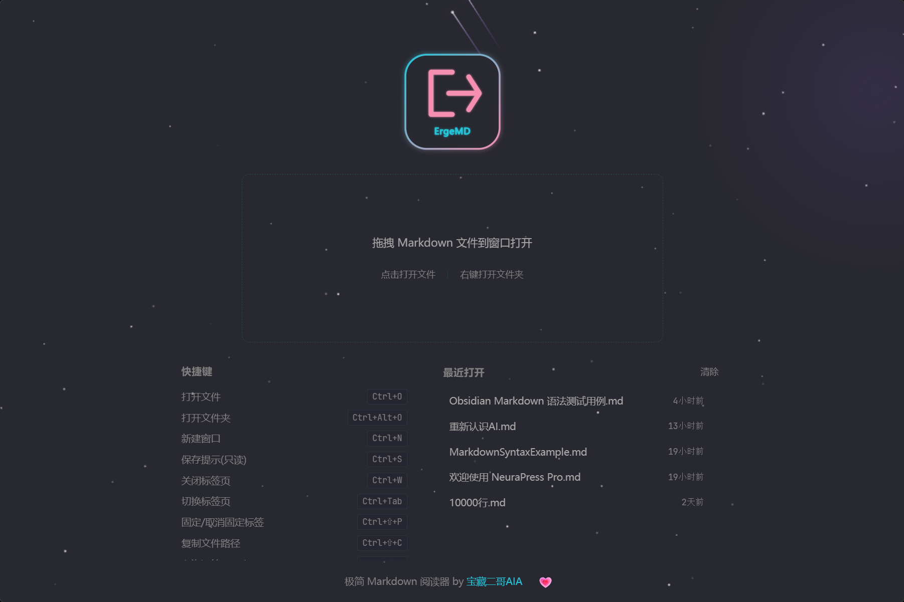

# HaogeMD

A desktop application focused on Markdown reading, with the core philosophy: **ultimate rendering beauty + silky smooth reading experience**.


[Core Features](#core-features) · [Download](#download) · [Building from Source](#building-from-source) · [Tech Stack](#tech-stack) · [User Guide](#user-guide) · [Documentation](#documentation)

[中文 README](./README.md)



## Core Features

- **Markdown Rendering**: GFM, Math formulas (KaTeX), Code highlighting, Mermaid diagrams, Task lists
- **Reading Experience**: Virtual scrolling, Progress tracking, 14 themes, Auto-generated floating TOC
- **Obsidian Syntax Compatibility**: Callout, Wiki links, Embedded references, Highlight markers, Comment hiding, Block IDs, and other Obsidian-specific syntax
- **Workspace Management**: Multi-tab, File tree, Bookmarks; Quick open file location
- **Export**: HTML, DOCX, PDF export; Mermaid diagrams save as SVG
- **Lightweight & Efficient**: Rust backend + React frontend, native desktop experience

## Download

Latest version **v0.5.0**:

| Type | Download Link |
|------|---------------|
| Portable (no install) | [HaogeMD-v0.5.0-portable.zip](https://github.com/oahhao/HaogeMD/releases/download/v0.5.0/HaogeMD-v0.5.0-portable.zip) |
| NSIS Installer | [HaogeMD-v0.5.0-setup.exe](https://github.com/oahhao/HaogeMD/releases/download/v0.5.0/HaogeMD-v0.5.0-setup.exe) |

### macOS Downloads

- [HaogeMD-v0.5.0-macos-arm64.dmg](https://github.com/oahhao/HaogeMD/releases/download/v0.5.0/HaogeMD-v0.5.0-macos-arm64.dmg) — Apple Silicon native installer
- [HaogeMD-v0.5.0-macos.dmg](https://github.com/oahhao/HaogeMD/releases/download/v0.5.0/HaogeMD-v0.5.0-macos.dmg) — Universal installer (**currently arm64-only; Intel Mac has no native build yet**)
- [HaogeMD-v0.5.0-macos.app.tar.gz](https://github.com/oahhao/HaogeMD/releases/download/v0.5.0/HaogeMD-v0.5.0-macos.app.tar.gz) — Command-line extractable

> **macOS Platform Note**: The CI matrix currently builds only Apple Silicon (arm64). `macos.dmg` and `macos.app.tar.gz` are both arm64 builds; Intel Mac users are not provided a native build yet.

> **Note**: v0.4.0 is **not code-signed** (free software strategy). On first launch, **right-click → Open** to bypass Gatekeeper.

### Linux Downloads

- [HaogeMD-v0.5.0-linux-x86_64.AppImage](https://github.com/oahhao/HaogeMD/releases/download/v0.5.0/HaogeMD-v0.5.0-linux-x86_64.AppImage) — No-install portable
- [HaogeMD-v0.5.0-linux-x86_64.deb](https://github.com/oahhao/HaogeMD/releases/download/v0.5.0/HaogeMD-v0.5.0-linux-x86_64.deb) — Debian / Ubuntu package

**System dependencies** (Ubuntu 22.04+ / Debian 12+):

```bash
sudo apt-get install -y libwebkit2gtk-4.1-0 libgtk-3-0
```

**CJK fonts recommended** (Linux default fonts have weak CJK support):

```bash
sudo apt-get install -y fonts-noto-cjk fonts-noto-color-emoji
```

For older versions, visit the [Releases page](https://github.com/oahhao/HaogeMD/releases).

## Building from Source

### Prerequisites

- Node.js 18+
- Rust (stable)
- pnpm 8+

### Build

```bash
# Install frontend dependencies
pnpm install

# Development mode (hot reload)
pnpm tauri dev

# Production build
pnpm tauri build
```

### Testing

```bash
# Frontend linting
pnpm lint

# Frontend build
pnpm build
```

## Tech Stack

| Layer             | Technology                                  |
| ----------------- | ------------------------------------------- |
| Desktop Framework | Tauri 2                                     |
| Frontend          | React 19 + TypeScript                       |
| Build Tool        | Vite 7                                      |
| State Management  | Zustand 5                                   |
| Styling           | Tailwind CSS 4 + CSS Variables Theme        |
| Markdown          | react-markdown + remark/rehype plugin chain |
| Math              | KaTeX                                       |
| Diagrams          | Mermaid                                     |
| Code Highlighting | highlight.js                                |
| Virtual Scrolling | @tanstack/react-virtual                     |
| Database          | SQLite (sqlx)                               |

## User Guide

### File Operations

| Action               | Shortcut           |
| -------------------- | ------------------ |
| Open file            | `Ctrl + O`         |
| Open folder          | `Ctrl + Shift + O` |
| Close current tab    | `Ctrl + W`         |
| Close other tabs     | `Ctrl + Shift + W` |
| Save file            | `Ctrl + S`         |
| Save as              | `Ctrl + Shift + S` |
| Refresh current file | `Ctrl + R`         |
| Show in Explorer     | `Ctrl + Shift + D` |
| Copy file path       | `Ctrl + Shift + C` |

### Tab Navigation

| Action             | Shortcut                               |
| ------------------ | -------------------------------------- |
| Next tab           | `Ctrl + Tab` / `Ctrl + PageDown`       |
| Previous tab       | `Ctrl + Shift + Tab` / `Ctrl + PageUp` |
| Switch to Nth tab  | `Ctrl + 1` ~ `Ctrl + 9`                |
| Pin/Unpin tab      | `Ctrl + Shift + P`                     |
| Open in new window | `Ctrl + N`                             |

### Reading Controls

| Action            | Shortcut                |
| ----------------- | ----------------------- |
| Zoom in           | `Ctrl + =` / `Ctrl + +` |
| Zoom out          | `Ctrl + -`              |
| Reset zoom        | `Ctrl + 0`              |
| Toggle fullscreen | `F11`                   |
| Toggle sidebar    | `Ctrl + B`              |
| Toggle file tree  | `Ctrl + Shift + B`      |
| Toggle focus mode | `Ctrl + Shift + F`      |
| Search content    | `Ctrl + F`              |
| Global search     | `Ctrl + Shift + F`      |
| Find next         | `F3`                    |
| Find previous     | `Shift + F3`            |
| Print             | `Ctrl + Shift + P`      |

### Export

| Action         | Shortcut           |
| -------------- | ------------------ |
| Export as HTML | `Ctrl + E`         |
| Export as PDF  | `Ctrl + P`         |
| Export as Word | `Ctrl + Shift + E` |

### Reading Area Context Menu

- **Copy** (`Ctrl + C`) — Copy selected text
- **Select All** (`Ctrl + A`) — Select all content
- **Search...** — Search with selected text
- **Edit Paragraph** (`Double-click`) — Quick edit current paragraph
- **Export as HTML** (`Ctrl + E`)
- **Export as PDF** (`Ctrl + P`)
- **Export as Word** (`Ctrl + Shift + E`)
- **Open in New Window** (`Ctrl + N`)

### Image Context Menu

- **Copy Image** — Copy image to clipboard
- **Zoom View** (`Click`) — Fullscreen preview
- **Open Image in New Window**
- **Copy Image Path**
- **Edit Image** — Modify image URL and description

### Code Block Context Menu

- **Copy Code** — Copy entire code block
- **Copy Selection** (`Ctrl + C`) — Copy selected code
- **Edit Code Block** — Quick edit code content

### Link Context Menu

- **Open Link** — Open in default browser
- **Copy Link** (`Ctrl + C`)
- **Edit Link** — Modify link text and URL

### Tab Bar Context Menu

- **Pin/Unpin Tab** (`Ctrl + Shift + P`)
- **Close Tab** (`Ctrl + W`)
- **Close Other Tabs**
- **Close Tabs to the Right**
- **Open in New Window** (`Ctrl + N`)
- **Copy File Path** (`Ctrl + Shift + C`)
- **Show in Explorer** (`Ctrl + Shift + D`)

### Theme & Appearance

- **Multi-theme**: 14 built-in themes
- **Font size**: Zoom in/out/reset
- **Focus mode**: Hide all UI elements for immersive reading

## Installation & Distribution

### Installer (Recommended)

Run the installer and follow the wizard. Benefits:

- Auto-create desktop shortcut and Start menu entry
- Auto-update support
- Associate `.md` and `.markdown` files, double-click to open with HaogeMD
- Normal uninstall via Control Panel

### Portable (No Install)

Run the executable directly, no installation needed. Suitable for:

- Carry on USB drive
- Quick trial without system traces
- Multi-version coexistence testing

> Note: Portable version does not associate file types or create shortcuts. Use the installer if you need these features.

## Documentation

| Document                       | Description                                 |
| ------------------------------ | ------------------------------------------- |
| [CHANGELOG.md](./CHANGELOG.md) | Version changelog                           |
| [TECH-SPEC.md](./TECH-SPEC.md) | Technical specification                     |
| [AGENTS.md](./AGENTS.md)       | Development guidelines and decision records |

## TODO / Roadmap

- [ ] **PDF Export Watermark**: Add watermark support for exported PDF files
- [x] **PDF Page Load Optimization**: Change from fixed 3-second delay to event-driven, waiting for DOM ready (optimized in v0.3.1 to 300ms WebView init + 2s render wait)
- [ ] **Cross-Platform Compatibility**: Unified PDF export solution for Windows/macOS/Linux, macOS uses WKWebView `createPDF`, Linux uses Qt WebEngine PrintToPdf

---

<div align="center">

If HaogeMD has been helpful to you, feel free to give it a ⭐!

<sub>Built with ❤️ and Rust</sub>

</div>

## License

Licensed under the [AGPL-3.0 License](./LICENSE).
