# Markdown 完整语法测试文档

## 一、基础语法

### 1.1 标题

# 一级标题

## 二级标题

### 三级标题

#### 四级标题

##### 五级标题

###### 六级标题

### 1.2 段落与换行

这是一段普通文本。段落之间用空行分隔。

这是第二段普通文本。\
这行使用了两个空格换行（上一行末尾有两个空格）。

### 1.3 强调

- **粗体文本** 使用双星号
- __粗体文本__ 使用双下划线
- *斜体文本* 使用单星号
- _斜体文本_ 使用单下划线
- ***粗斜体文本*** 使用三星号
- ~~删除线文本~~ 使用双波浪号
- 这是行内代码：`console.log("Hello")`
- 这是 **粗体里有 `inline code`** 的组合。
- 这是 `https://example.com` 和 **`https://example.com`**。
- 这是一个普通链接：https://example.com 。
- 这是 ==mark 如果渲染支持== 或 HTML <mark>高亮文本</mark>。
- 请按 <kbd>Ctrl</kbd> + <kbd>S</kbd> 保存。
- 这是 <samp>sample output</samp>。
- 这是 <ins>插入文本</ins>。

### 1.4 引用

> 这是一级引用
>
> > 这是二级引用
> >
> > > 这是三级引用

> **注意**：引用中也可以使用其他 Markdown 语法
>
> - 列表项一
> - 列表项二
> - `代码` 也可以

### 1.5 列表

无序列表：

- 项目一
  - 子项目 1.1
    - 子子项目 1.1.1
  - 子项目 1.2
- 项目二
- 项目三

有序列表：

1. 第一步
2. 第二步
   1. 子步骤 2.1
   2. 子步骤 2.2---
3. 第三步

任务列表：

- [x] 已完成的任务
- [x] 另一个已完成的任务
- [ ] 未完成的任务
- [ ] 另一个未完成的任务

定义列表（部分解析器支持）：

术语一
: 定义一的内容

术语二
: 定义二的内容

### 1.6 分割线

***

***

***

### 1.7 链接

行内链接：[百度](https://www.baidu.com)

带标题的链接：[Google](https://www.google.com "点击访问 Google")

直接URL：<https://www.example.com>

邮箱链接：<contact@example.com>

引用式链接：

[引用链接一](https://www.example.com "示例网站")
[引用链接二](https://www.example.org "另一个示例")

### 1.8 图片

行内图片：


引用式图片：


带链接的图片：

[](https://space.bilibili.com/67221461)

***

## 二、转义字符

\# 这不是标题\
\* 这不是斜体 \*\
\_ 这不是斜体 \_\
\~\~ 这不是删除线 \~\~\
\` 这不是代码 \`\
\ 这是反斜杠本身\
\| 这不是表格分隔符

特殊字符：& < > " © ®

***

## 三、代码

### 3.1 行内代码

使用 `pip install requests` 安装依赖。变量名是 `count`。

### 3.2 代码块

```python
# Python 示例
import asyncio
from typing import List, Optional

async def fetch_data(url: str, timeout: int = 30) -> Optional[dict]:
    """异步获取数据"""
    import aiohttp
    async with aiohttp.ClientSession() as session:
        async with session.get(url, timeout=aiohttp.ClientTimeout(total=timeout)) as resp:
            if resp.status == 200:
                return await resp.json()
    return None

class DataProcessor:
    def __init__(self, data: List[dict]):
        self.data = data
        self._cache = {}

    @property
    def count(self) -> int:
        return len(self.data)

    def filter_by(self, key: str, value) -> List[dict]:
        return [item for item in self.data if item.get(key) == value]

if __name__ == "__main__":
    urls = ["https://api.example.com/data"] * 5
    results = asyncio.gather(*[fetch_data(url) for url in urls])
```

```javascript
// JavaScript 示例
class EventEmitter {
  #listeners = new Map();

  on(event, callback) {
    if (!this.#listeners.has(event)) {
      this.#listeners.set(event, []);
    }
    this.#listeners.get(event).push(callback);
    return () => this.off(event, callback);
  }

  off(event, callback) {
    const callbacks = this.#listeners.get(event);
    if (callbacks) {
      this.#listeners.set(event, callbacks.filter(cb => cb !== callback));
    }
  }

  emit(event, ...args) {
    const callbacks = this.#listeners.get(event);
    callbacks?.forEach(cb => cb(...args));
  }
}

const emitter = new EventEmitter();
const unsub = emitter.on('data', (payload) => console.log(payload));
emitter.emit('data', { message: 'Hello, World!' });
unsub();
```

```json
{
  "name": "Markdown 测试文档",
  "version": "1.0.0",
  "author": {
    "name": "张三",
    "email": "zhangsan@example.com"
  },
  "tags": ["markdown", "test", "demo"],
  "features": [
    { "name": "表格", "supported": true },
    { "name": "流程图", "supported": true },
    { "name": "数学公式", "supported": true }
  ]
}
```

```bash
#!/bin/bash
# Shell 脚本示例
echo "Starting deployment..."

ENV=${1:-production}
DEPLOY_DIR="/var/www/app"

# 停止服务
systemctl stop myapp.service

# 备份当前版本
tar -czf "backup_$(date +%Y%m%d_%H%M%S).tar.gz" "$DEPLOY_DIR"

# 部署新版本
rsync -avz --delete ./dist/ "$DEPLOY_DIR/"

# 重启服务
systemctl start myapp.service

echo "Deployment to $ENV completed!"
```

```css
/* CSS 示例 */
:root {
  --primary-color: #3b82f6;
  --bg-color: #f8fafc;
  --text-color: #1e293b;
  --border-radius: 8px;
}

.markdown-body {
  font-family: 'Inter', -apple-system, BlinkMacSystemFont, sans-serif;
  color: var(--text-color);
  background: var(--bg-color);
  line-height: 1.75;
  max-width: 800px;
  margin: 0 auto;
  padding: 2rem;
}

.markdown-body h1 {
  font-size: 2.25em;
  border-bottom: 2px solid var(--primary-color);
  padding-bottom: 0.3em;
}

.markdown-body code {
  background: #e2e8f0;
  padding: 0.2em 0.4em;
  border-radius: 3px;
  font-size: 0.875em;
}
```

```rust
// Rust 示例
fn main() {
    println!("Hello, ErgeMD!");
    
    let numbers = vec![1, 2, 3, 4, 5];
    let sum: i32 = numbers.iter().sum();
    println!("Sum: {}", sum);
    
    let result = divide(10, 2);
    match result {
        Some(value) => println!("Result: {}", value),
        None => println!("Cannot divide by zero"),
    }
}

fn divide(a: i32, b: i32) -> Option<i32> {
    if b == 0 {
        None
    } else {
        Some(a / b)
    }
}

#[derive(Debug)]
struct Point {
    x: i32,
    y: i32,
}

impl Point {
    fn new(x: i32, y: i32) -> Self {
        Point { x, y }
    }
    
    fn distance(&self, other: &Point) -> f64 {
        let dx = (self.x - other.x) as f64;
        let dy = (self.y - other.y) as f64;
        (dx * dx + dy * dy).sqrt()
    }
}
```

```typescript
// TypeScript 示例
interface User {
    id: number;
    name: string;
    email: string;
    isActive: boolean;
}

class UserService {
    private users: User[] = [];
    
    addUser(user: User): void {
        this.users.push(user);
    }
    
    getUserById(id: number): User | undefined {
        return this.users.find(u => u.id === id);
    }
    
    getActiveUsers(): User[] {
        return this.users.filter(u => u.isActive);
    }
    
    async fetchUsersFromAPI(url: string): Promise<User[]> {
        const response = await fetch(url);
        const data = await response.json();
        return data as User[];
    }
}

const service = new UserService();
service.addUser({ id: 1, name: "张三", email: "zhangsan@example.com", isActive: true });
service.addUser({ id: 2, name: "李四", email: "lisi@example.com", isActive: false });

console.log(service.getActiveUsers());
```

```go
// Go 示例
package main

import (
    "fmt"
    "time"
)

func main() {
    fmt.Println("Hello, ErgeMD!")
    
    now := time.Now()
    fmt.Printf("当前时间: %s\n", now.Format(time.RFC3339))
    
    numbers := []int{1, 2, 3, 4, 5}
    sum := 0
    for _, num := range numbers {
        sum += num
    }
    fmt.Printf("总和: %d\n", sum)
    
    result, err := divide(10, 2)
    if err != nil {
        fmt.Printf("错误: %v\n", err)
    } else {
        fmt.Printf("结果: %d\n", result)
    }
    
    p := NewPoint(3, 4)
    fmt.Printf("点: %v\n", p)
}

func divide(a, b int) (int, error) {
    if b == 0 {
        return 0, fmt.Errorf("不能除以零")
    }
    return a / b, nil
}

type Point struct {
    X, Y int
}

func NewPoint(x, y int) *Point {
    return &Point{X: x, Y: y}
}
```

```java
// Java 示例
import java.util.*;

public class UserService {
    private List<User> users = new ArrayList<>();
    
    public void addUser(User user) {
        users.add(user);
    }
    
    public Optional<User> getUserById(int id) {
        return users.stream()
            .filter(u -> u.getId() == id)
            .findFirst();
    }
    
    public List<User> getActiveUsers() {
        return users.stream()
            .filter(User::isActive)
            .toList();
    }
    
    public static void main(String[] args) {
        System.out.println("Hello, ErgeMD!");
        
        UserService service = new UserService();
        service.addUser(new User(1, "张三", "zhangsan@example.com", true));
        service.addUser(new User(2, "李四", "lisi@example.com", false));
        
        service.getActiveUsers().forEach(System.out::println);
    }
}

class User {
    private int id;
    private String name;
    private String email;
    private boolean active;
    
    public User(int id, String name, String email, boolean active) {
        this.id = id;
        this.name = name;
        this.email = email;
        this.active = active;
    }
    
    public int getId() { return id; }
    public String getName() { return name; }
    public String getEmail() { return email; }
    public boolean isActive() { return active; }
    
    @Override
    public String toString() {
        return String.format("User{id=%d, name='%s'}", id, name);
    }
}
```

```sql
-- SQL 示例
CREATE TABLE users (
    id INTEGER PRIMARY KEY AUTOINCREMENT,
    name TEXT NOT NULL,
    email TEXT UNIQUE NOT NULL,
    is_active BOOLEAN DEFAULT TRUE,
    created_at TIMESTAMP DEFAULT CURRENT_TIMESTAMP
);

CREATE TABLE orders (
    id INTEGER PRIMARY KEY AUTOINCREMENT,
    user_id INTEGER NOT NULL,
    total DECIMAL(10, 2) NOT NULL,
    status TEXT DEFAULT 'pending',
    created_at TIMESTAMP DEFAULT CURRENT_TIMESTAMP,
    FOREIGN KEY (user_id) REFERENCES users(id)
);

-- 插入数据
INSERT INTO users (name, email) VALUES 
('张三', 'zhangsan@example.com'),
('李四', 'lisi@example.com'),
('王五', 'wangwu@example.com');

INSERT INTO orders (user_id, total, status) VALUES 
(1, 99.99, 'completed'),
(1, 199.99, 'shipping'),
(2, 59.99, 'pending');

-- 查询
SELECT u.name, o.total, o.status, o.created_at
FROM users u
JOIN orders o ON u.id = o.user_id
WHERE o.status = 'completed'
ORDER BY o.created_at DESC;

-- 聚合查询
SELECT 
    u.name,
    COUNT(o.id) AS order_count,
    SUM(o.total) AS total_spent
FROM users u
LEFT JOIN orders o ON u.id = o.user_id
GROUP BY u.id, u.name
HAVING COUNT(o.id) > 0;
```

```diff
# Diff 示例 - 显示代码变更
- 使用旧版 API 进行认证
+ 使用新版 JWT API 进行认证
  支持多种认证方式
- 移除了 session 管理
+ 添加了 token 刷新机制
```

***

## 四、表格

### 4.1 基础表格

| 编号 | 姓名 | 年龄 | 城市 | 职业       |
| ---- | ---- | ---- | ---- | ---------- |
| 001  | 张三 | 28   | 北京 | 前端工程师 |
| 002  | 李四 | 32   | 上海 | 后端工程师 |
| 003  | 王五 | 25   | 深圳 | UI 设计师  |
| 004  | 赵六 | 30   | 杭州 | 产品经理   |

### 4.2 对齐表格

| 左对齐         |     居中对齐     |         右对齐 |
| :------------- | :--------------: | -------------: |
| 内容 A         |      内容 B      |         内容 C |
| 较长文本左对齐 | 较长文本居中对齐 | 较长文本右对齐 |
| L              |        C         |              R |

### 4.3 表格内使用 Markdown

| 功能     | 描述             | 示例                          |
| -------- | ---------------- | ----------------------------- |
| 粗体     | 在表格中使用加粗 | **重要内容**                  |
| 斜体     | 在表格中使用斜体 | *注意事项*                    |
| 行内代码 | 在表格中显示代码 | `npm install`                 |
| 链接     | 在表格中插入链接 | [百度](https://www.baidu.com) |
| 列表     | 在表格中使用列表 | - 项目一- 项目二              |
| 多行文本 | 支持换行内容     | 第一行第二行                  |

***

## 五、数学公式

### 5.1 行内公式

质能方程 $E = mc^2$，欧拉公式 $e^{i\pi} + 1 = 0$，求和 $\sum_{i=1}^{n} i = \frac{n(n+1)}{2}$。

### 5.2 块级公式

$$
\int_{-\infty}^{+\infty} e^{-x^2} dx = \sqrt{\pi}
$$

$$
\frac{\partial^2 u}{\partial t^2} = c^2 \nabla^2 u
$$

$$
\begin{bmatrix}
a_{11} & a_{12} & a_{13} \\
a_{21} & a_{22} & a_{23} \\
a_{31} & a_{32} & a_{33}
\end{bmatrix}
\begin{bmatrix}
x_1 \\ x_2 \\ x_3
\end{bmatrix}
=
\begin{bmatrix}
b_1 \\ b_2 \\ b_3
\end{bmatrix}
$$

$$
f(x) = \begin{cases}
x^2 & \text{if } x \geq 0 \\
-x^2 & \text{if } x < 0
\end{cases}
$$

$$
\mathcal{L} = -\frac{1}{N}\sum_{i=1}^{N} \left[ y_i \log(\hat{y}_i) + (1-y_i)\log(1-\hat{y}_i) \right]
$$


***

## 六、Mermaid 图表

### 6.1 [流程图](https://mermaid.nodejs.cn/syntax/flowchart.html)

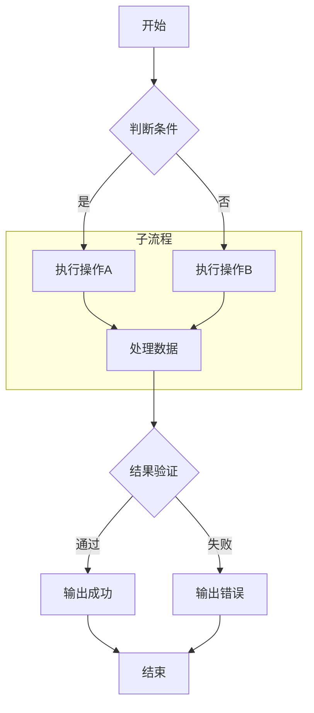

### 6.2 [时序图](https://mermaid.nodejs.cn/syntax/sequenceDiagram.html)

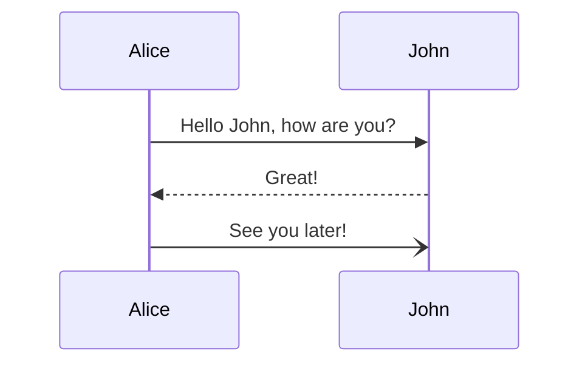

### 6.3 [类图](https://mermaid.nodejs.cn/syntax/classDiagram.html)

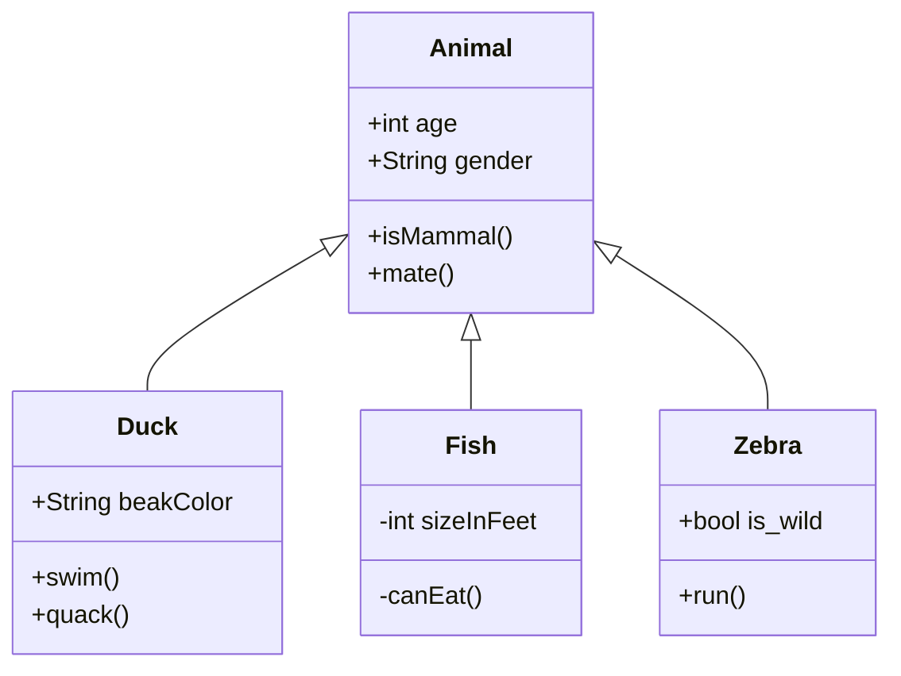

### 6.4 [状态图](https://mermaid.nodejs.cn/syntax/stateDiagram.html)

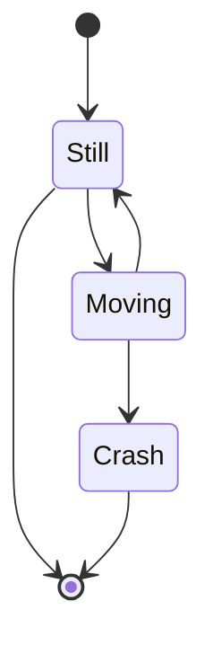

### 6.5 [实体关系图](https://mermaid.nodejs.cn/syntax/entityRelationshipDiagram.html)

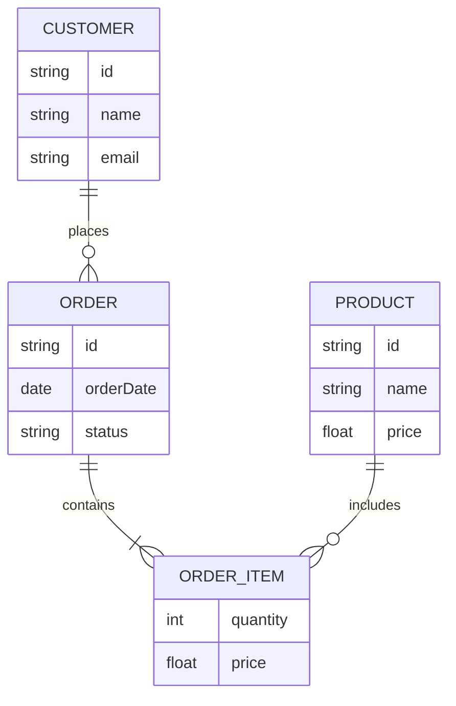

### 6.6 [用户旅程图](https://mermaid.nodejs.cn/syntax/userJourney.html)

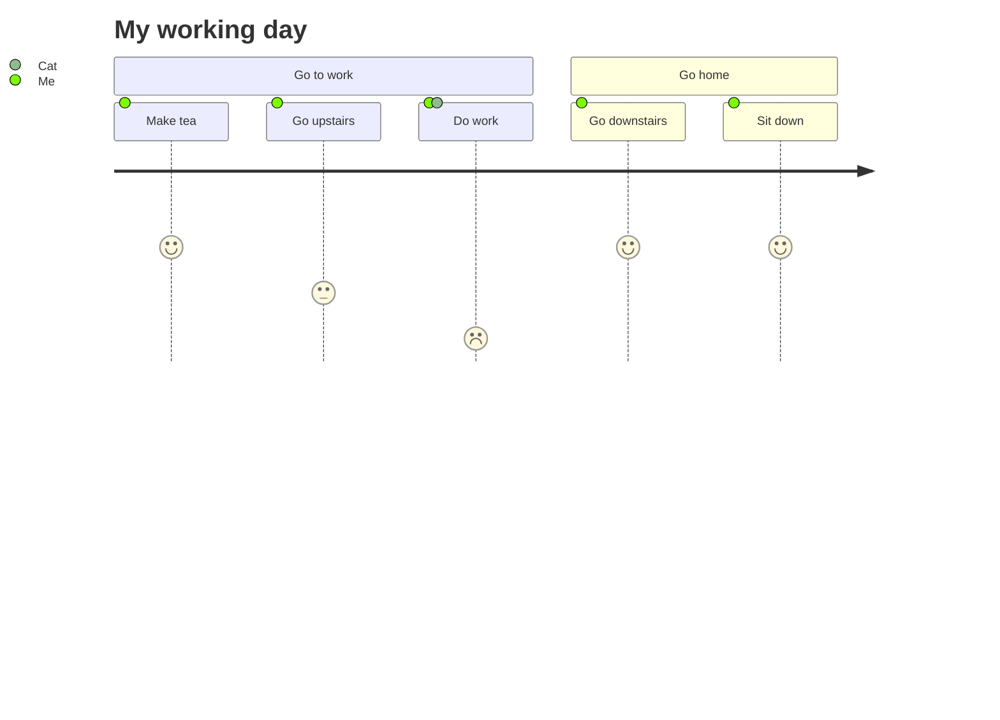

### 6.7 [甘特图](https://mermaid.nodejs.cn/syntax/gantt.html)

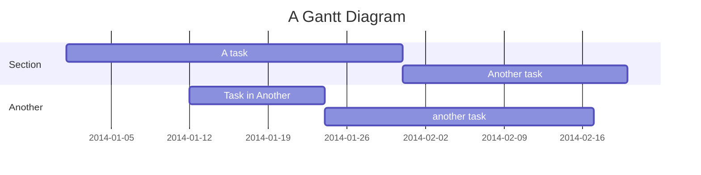

### 6.8 [饼图](https://mermaid.nodejs.cn/syntax/pie.html)

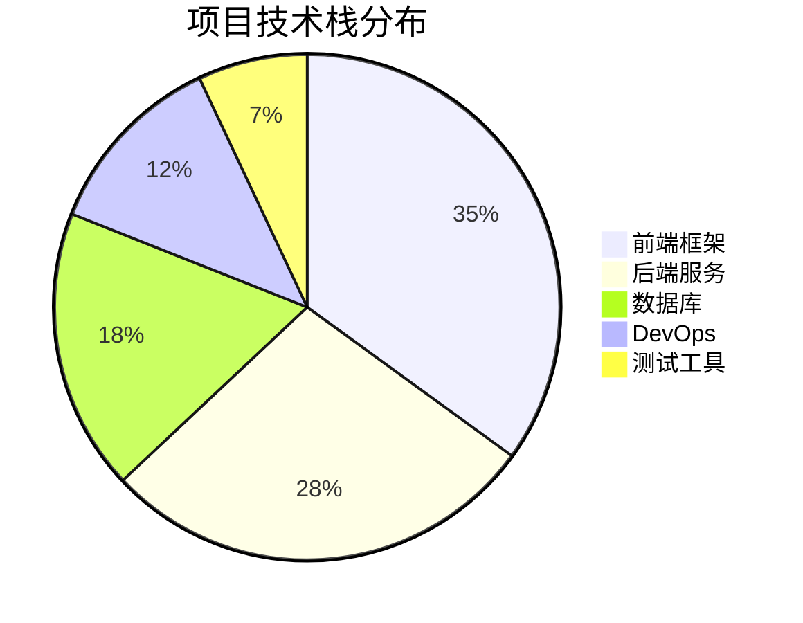

### 6.9 [象限图](https://mermaid.nodejs.cn/syntax/quadrantChart.html)


### 6.10 [需求图](https://mermaid.nodejs.cn/syntax/requirementDiagram.html)

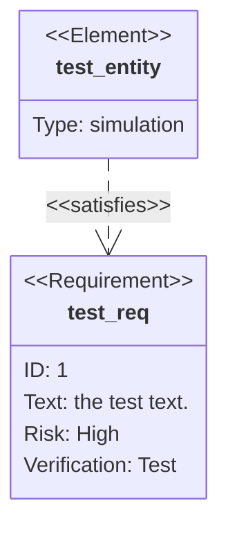

### 6.11 [Git 提交历史图](https://mermaid.nodejs.cn/syntax/gitgraph.html)

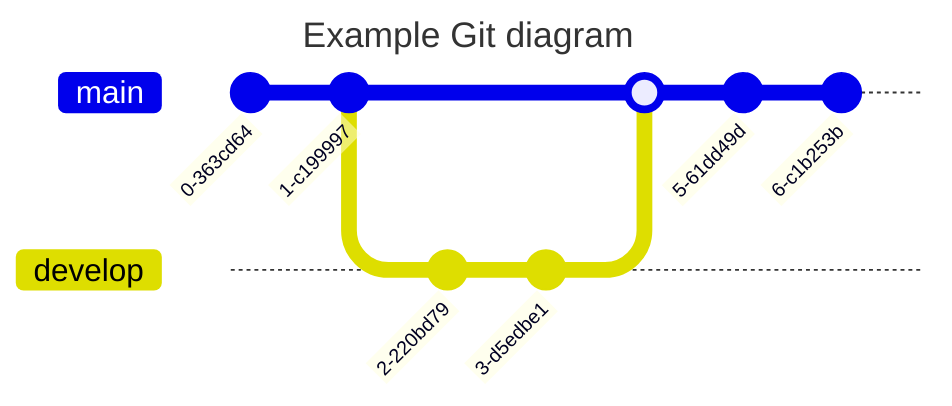

### 6.12 [C4 架构图](https://mermaid.nodejs.cn/syntax/c4.html)

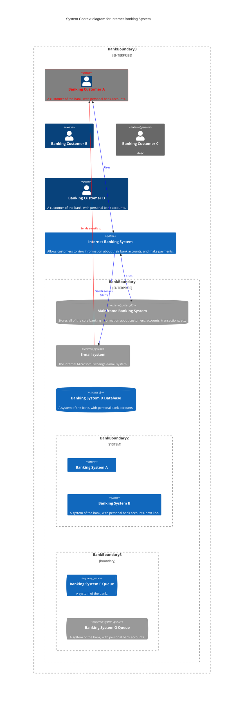

### 6.13 [思维导图](https://mermaid.nodejs.cn/syntax/mindmap.html)

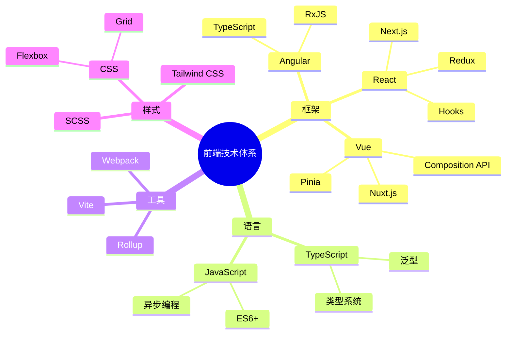

### 6.14 [时间线](https://mermaid.nodejs.cn/syntax/timeline.html)

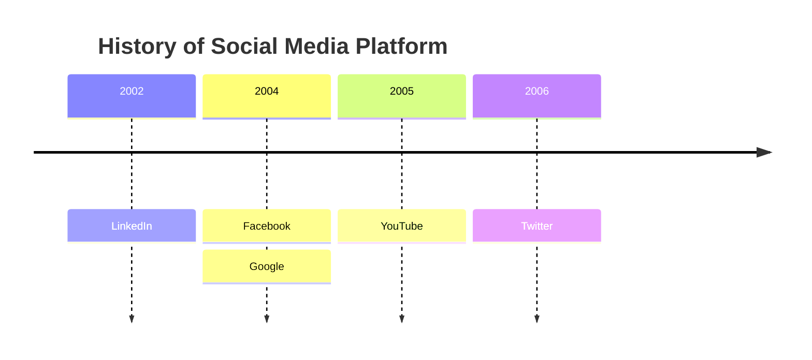

### 6.15 [ZenUML](https://mermaid.nodejs.cn/syntax/zenuml.html)

> **暂不支持说明**：ZenUML 不是当前 Mermaid 11.14.0 内置 diagram，需外部插件 `@mermaid-js/mermaid-zenuml` 注册后才可渲染。当前表现：UnknownDiagramError。

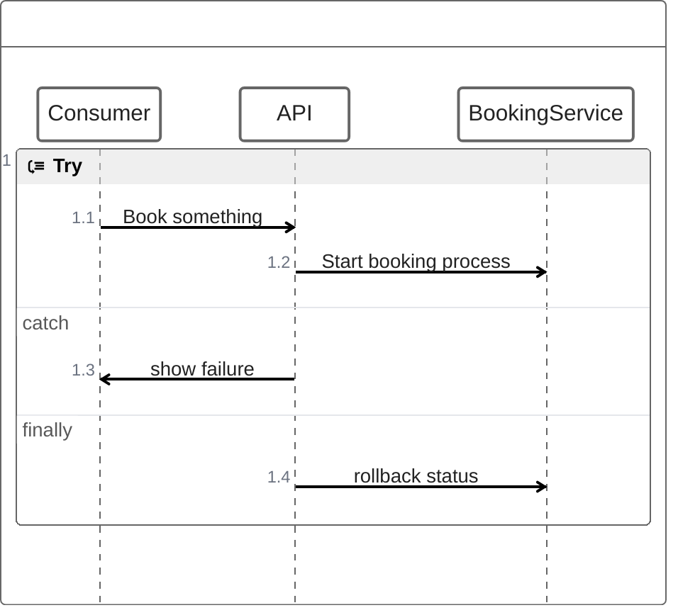

### 6.16 [桑基图](https://mermaid.nodejs.cn/syntax/sankey.html)

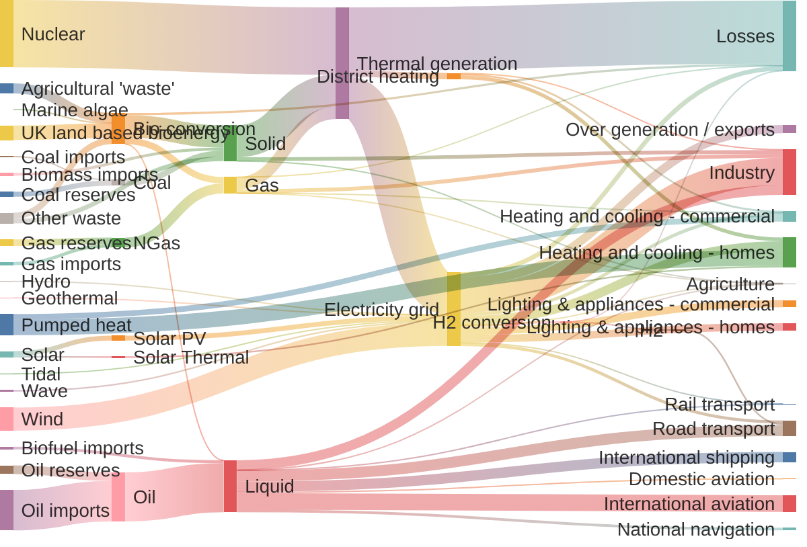

### 6.17 [XY 图表](https://mermaid.nodejs.cn/syntax/xychart.html)

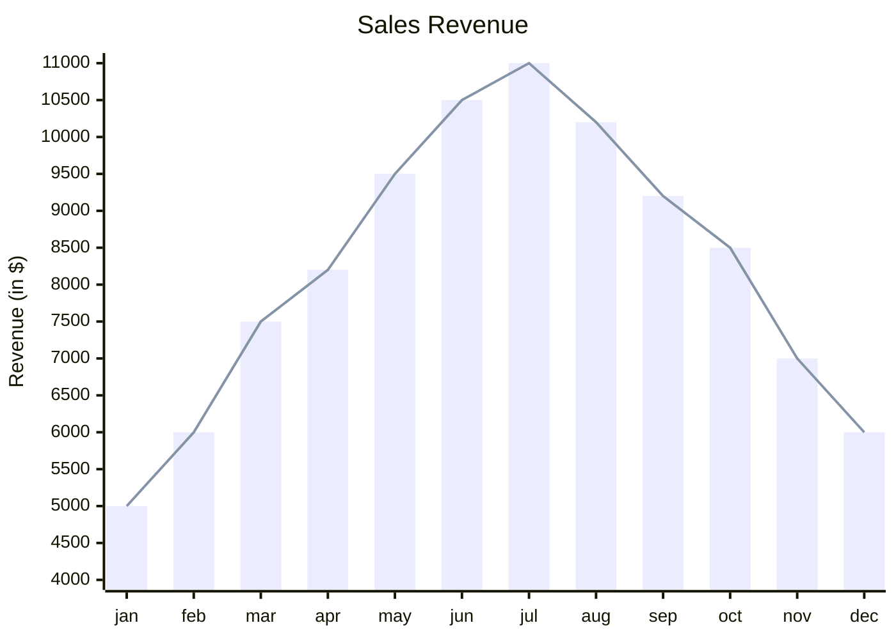

### 6.18 [块图](https://mermaid.nodejs.cn/syntax/block.html)

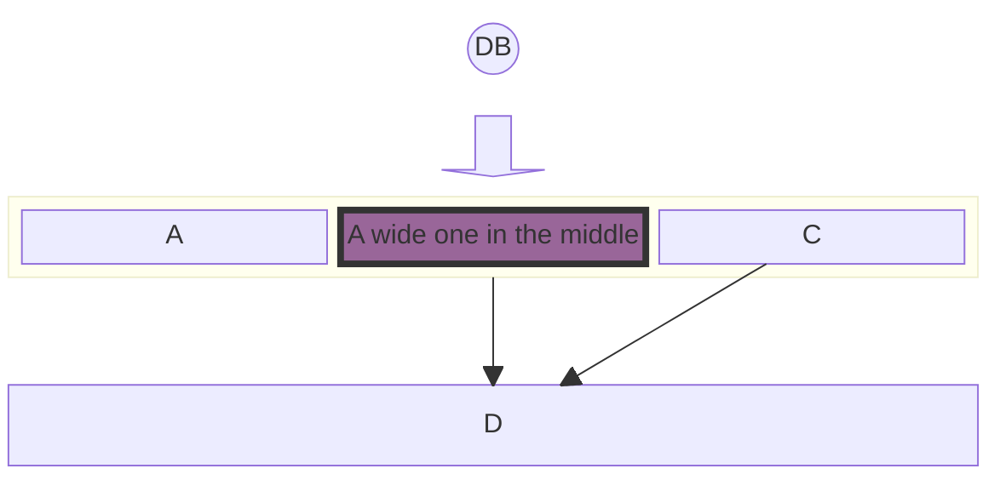

### 6.19 [数据包图](https://mermaid.nodejs.cn/syntax/packet.html)

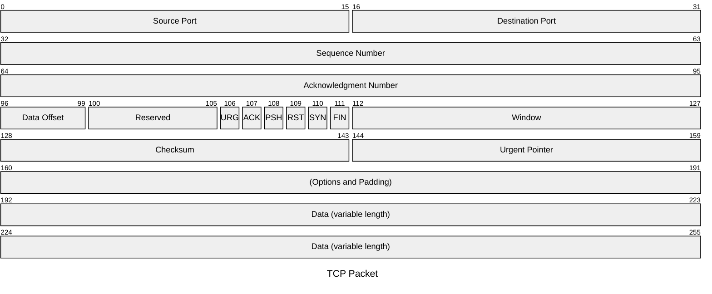

### 6.20 [看板图](https://mermaid.nodejs.cn/syntax/kanban.html)

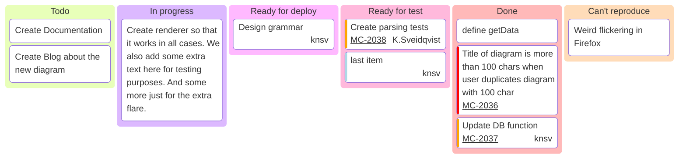

### 6.21 [架构图](https://mermaid.nodejs.cn/syntax/architecture.html)

```mermaid
architecture-beta
    %% 定义一个顶级群组：云端 VPC
    group vpc(cloud)[Public VPC]

    %% 在 VPC 组内定义服务
    service gateway(internet)[Internet Gateway] in vpc
    service auth_server(server)[Auth Server] in vpc
    
    %% 定义一个嵌套子组：私有子网
    group private_subnet(cloud)[Private Subnet] in vpc
    
    %% 在子组内定义数据库和存储
    service main_db(database)[Main DB] in private_subnet
    service backup_disk(disk)[Backup Disk] in private_subnet
    
    %% 定义一个交汇点，用于多路连接
    junction router in vpc

    %% 建立连接 (使用 L|R|T|B 指定方向)
    gateway:B -- T:router
    router:L -- R:auth_server
    router:B -- T:main_db
    
    %% 数据库到磁盘的单向带箭头连接
    main_db:R --> L:backup_disk

```

### 6.22 [雷达图](https://mermaid.nodejs.cn/syntax/radar.html)

```mermaid
radar-beta
  title Restaurant Comparison
  axis food["Food Quality"], service["Service"], price["Price"]
  axis ambiance["Ambiance"]

  curve a["Restaurant A"]{4, 3, 2, 4}
  curve b["Restaurant B"]{3, 4, 3, 3}
  curve c["Restaurant C"]{2, 3, 4, 2}
  curve d["Restaurant D"]{2, 2, 4, 3}

  graticule polygon
  max 5
```

### 6.23 [事件建模图](https://mermaid.nodejs.cn/syntax/eventModelling.html)

> **暂不支持说明**：Event Modeling 不是当前 Mermaid 11.14.0 内置 diagram，当前 `eventmodeling` 关键字会触发 UnknownDiagramError。**不计入 Mermaid 主题系统测试失败**。如未来需要支持，应单独调研外部插件 `@howarddierking/mermaid-event-model` 或正确语法关键字。

```mermaid
eventmodeling

tf 01 ui CartUI
tf 02 cmd AddItem [[AddItem01]]
tf 03 evt ItemAdded [[ItemAdded]]
tf 04 cmd AddItem [[AddItem02]]
tf 05 evt ItemAdded [[ItemAdded]]

data AddItem01 {
  description: 'john'
  image: 'avatar_john'
  price: 20.4
}

data AddItem02 {
  description: 'jack'
  image: 'avatar_jack'
  price: 12.5
}

data ItemAdded {
  description: string
  image: string
  price: number
}
```

### 6.24 [树状图](https://mermaid.nodejs.cn/syntax/tree.html)

```mermaid
treemap-beta
"Section 1"
    "Leaf 1.1": 12
    "Section 1.2":::class1
      "Leaf 1.2.1": 12
"Section 2"
    "Leaf 2.1": 20:::class1
    "Leaf 2.2": 25
    "Leaf 2.3": 12

classDef class1 fill:red,color:blue,stroke:#FFD600;

```

### 6.25 [维恩图](https://mermaid.nodejs.cn/syntax/venn.html)

```mermaid
venn-beta
  set A["Alpha"]:20
    text A1["React"]
    text A2["Design Systems"]
  set B["Beta"]:12
  union A,B["AB"]:3
  style A fill:#ff6b6b
  style A,B color:#333
  style A1 color:red

```

### 6.26 [石川图](https://mermaid.nodejs.cn/syntax/ishikawa.html)

```mermaid
ishikawa-beta
    Blurry Photo
    Process
        Out of focus
        Shutter speed too slow
        Protective film not removed
        Beautification filter applied
    User
        Shaky hands
    Equipment
        LENS
            Inappropriate lens
            Damaged lens
            Dirty lens
        SENSOR
            Damaged sensor
            Dirty sensor
    Environment
        Subject moved too quickly
        Too dark

```

### 6.27 [沃德利地图](https://mermaid.nodejs.cn/syntax/wardley.html)

```mermaid
wardley-beta
title Link Types

component User [0.90, 0.95]
component App [0.75, 0.75]
component API [0.60, 0.60]
component Cache [0.65, 0.45]
component Database [0.15, 0.80]

User -> App
App +> API
API -> Database
API +<> Cache
Cache +'backup'> Database
```

### 6.28 [树形视图](https://mermaid.nodejs.cn/syntax/treeView.html)

```mermaid
treeView-beta
    "my-project"
        "src"
            "App.tsx"
            "index.js"
        ".env"
        "Dockerfile"
        "package.json"
```

***

## 七、目录（TOC）

[TOC]

***

## 八、脚注

这是一个包含脚注的文本[^1]，也可以有多个脚注[^2]。长文本支持[^long]。

[^1]: 这是第一个脚注的内容。

[^2]: 这是第二个脚注的内容，可以包含更多文字。

[^long]: 这是一个较长的脚注，可以包含多行内容。脚注在文档末尾显示，点击上标可以跳转到对应位置。

***

## 九、锚点链接（页内跳转）

### 9.1 标题锚点

跳转到 [六、Mermaid 图表](#六mermaid-图表)

跳转到 [4.3 表格内使用 Markdown](#43-表格内使用-markdown)

### 9.2 自定义锚点

<a id="custom-anchor"></a>
这里有一个自定义锚点，可以通过链接跳转到这里。

[跳转到自定义锚点](#custom-anchor)

***

## 十、上标与下标

### 10.1 上标

H\~2\~O 是水的化学式，E = mc^2^ 是质能方程。

### 10.2 下标

化学元素：Na\~2\~CO\~3\~（碳酸钠），数学下标：x\~1\~, x\~2\~, ..., x\~n\~

***

## 十一、Admonition 提示框

> [!NOTE]
> 这是一个提示框，用于展示一般性的注意事项。

> [!TIP]
> 这是一个技巧提示框，用于展示实用的小技巧。

> [!WARNING]
> 这是一个警告提示框，用于提醒用户注意可能存在的风险。

> [!CAUTION]
> 这是一个严重警告提示框，用于提醒用户可能造成的严重后果。

> [!IMPORTANT]
> 这是一个重要信息提示框，用于展示关键信息。

> [!INFO]
> 这是一个信息提示框，用于展示补充说明信息。

> [!SUCCESS]
> 这是一个成功提示框，用于展示操作成功的信息。

> [!ERROR]
> 这是一个错误提示框，用于展示操作失败或错误信息。

> [!DANGER]
> 这是一个危险提示框，用于展示可能导致严重后果的警告。

***

## 十二、自动链接识别

标准的 URL 会被自动识别为链接，无需方括号：

<https://www.example.com>

<http://example.org>

[www.example.com](http://www.example.com)

邮箱地址也会被自动识别：

<contact@example.com>

<support@company.org>

***

## 十三、HTML 标签（部分解析器支持）

<div style="border: 1px solid #ccc; padding: 16px; border-radius: 8px; background: #f9f9f9;">
  <h4 style="color: #3b82f6; margin-top: 0;">自定义 HTML 容器</h4>
  <p>这是通过 HTML 标签嵌入的内容，可以用来实现 Markdown 不直接支持的样式。</p>
</div>

<br />

<details>
<summary>点击展开详细内容</summary>

这是折叠的详细内容，点击后可以展开查看。可以包含任何 Markdown 内容：

- 列表项一
- 列表项二
- **粗体** 和 *斜体* 也可以

</details>

<br />

<mark>高亮标记文本</mark>

<abbr title="HyperText Markup Language">HTML</abbr> 是一种标记语言。

<!-- 这是一条 HTML 注释，不会显示 -->

***

## 十四、嵌套结构

### 14.1 列表嵌套代码块

1. 安装依赖：
   ```bash
   npm install express
   ```
2. 创建服务器：
   ```javascript
   const express = require('express');
   const app = express();
   app.get('/', (req, res) => res.send('Hello World!'));
   app.listen(3000);
   ```
3. 访问 `http://localhost:3000`

### 14.2 引用嵌套列表与代码

> 配置步骤：
>
> 1. 创建配置文件 `config.json`
>    ```json
>    {
>      "port": 8080,
>      "host": "localhost"
>    }
>    ```
> 2. 设置环境变量：
>    ```bash
>    export APP_ENV=production
>    ```
> 3. 启动服务：`npm start`

***

## 十五、特殊内容

### 15.1 Emoji

:smile: :heart: :+1: :rocket: :fire: :100: :coffee: :bulb: :star: :tada: :muscle: :sparkles:

### 15.2 键盘按键

按 <kbd>Ctrl</kbd> + <kbd>C</kbd> 复制，<kbd>Ctrl</kbd> + <kbd>V</kbd> 粘贴。

### 15.3 缩写

\*\[HTML]: HyperText Markup Language
\*\[CSS]: Cascading Style Sheets
\*\[API]: Application Programming Interface

HTML 和 CSS 是前端开发的基础，API 是后端提供的能力。

### 15.4 数学矩阵和公式（更多示例）

薛定谔方程：

$$
i\hbar\frac{\partial}{\partial t}\Psi(\mathbf{r},t) = \hat{H}\Psi(\mathbf{r},t)
$$

贝叶斯定理：

$$
P(A|B) = \frac{P(B|A) \cdot P(A)}{P(B)}
$$

麦克斯韦方程组：

$$
\nabla \cdot \mathbf{E} = \frac{\rho}{\varepsilon\_0}, \quad \nabla \cdot \mathbf{B} = 0
$$

$$
\nabla \times \mathbf{E} = -\frac{\partial \mathbf{B}}{\partial t}, \quad \nabla \times \mathbf{B} = \mu\_0\mathbf{J} + \mu\_0\varepsilon\_0\frac{\partial \mathbf{E}}{\partial t}
$$

***

*文档生成时间：2026-04-30*
*本文档涵盖了 Markdown 绝大多数语法元素，可用于阅读器功能完整性测试。*

这份文档覆盖了以下所有语法元素：

- **基础**：6级标题、段落、换行、粗体、斜体、粗斜体、删除线、行内代码
- **块级**：引用（含嵌套）、有序/无序/任务列表、分割线
- **链接与图片**：行内链接、带标题链接、自动链接、邮箱链接、引用式链接、行内/引用式/带链接图片、锚点链接（页内跳转）
- **代码**：行内代码、多语言代码块（Python / JS / JSON / Bash / CSS / Rust / TypeScript / Go / Java / SQL）、Diff 代码块
- **表格**：普通表格、三种对齐方式表格、表格内使用 Markdown
- **数学公式**：行内公式、块级公式、矩阵、分段函数、偏微分方程等
- **Mermaid 图表**：流程图、时序图、甘特图、饼图、类图、状态图、ER图、用户旅程图、思维导图、XY图表、Git 提交历史图、C4 架构图、桑基图、时间线、需求图、象限图、雷达图、树形图、块图
- **扩展语法**：目录 \[TOC]、脚注、HTML标签（容器/折叠/高亮/键盘按键/自定义锚点）、转义字符、Emoji、嵌套结构、上标/下标、Admonition 提示框、自动链接识别、缩写

