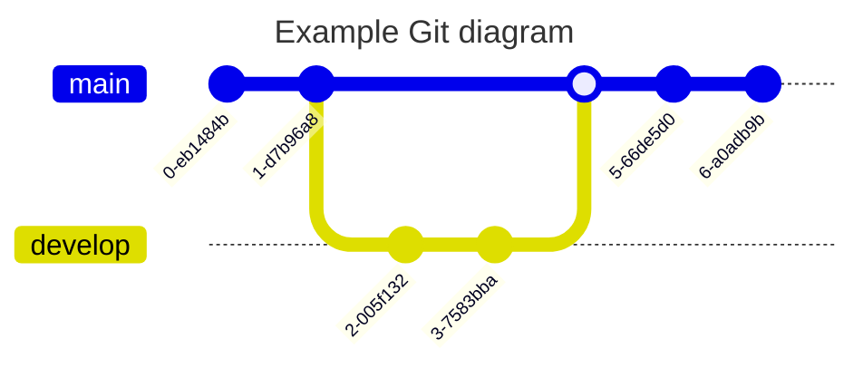
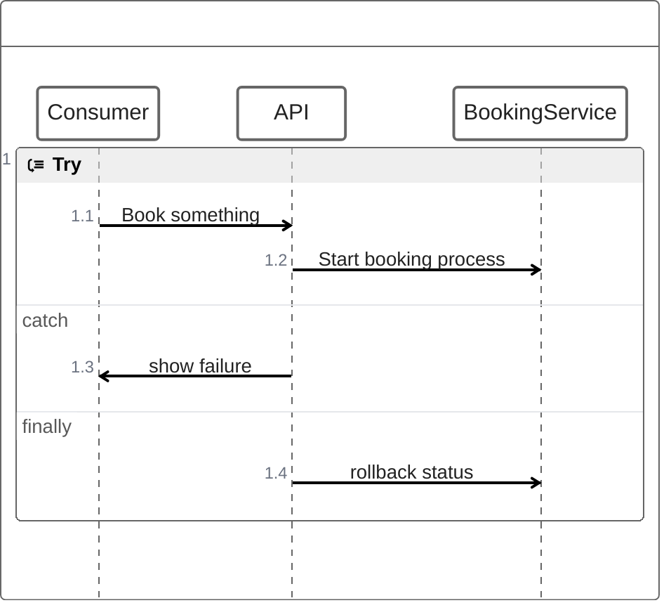
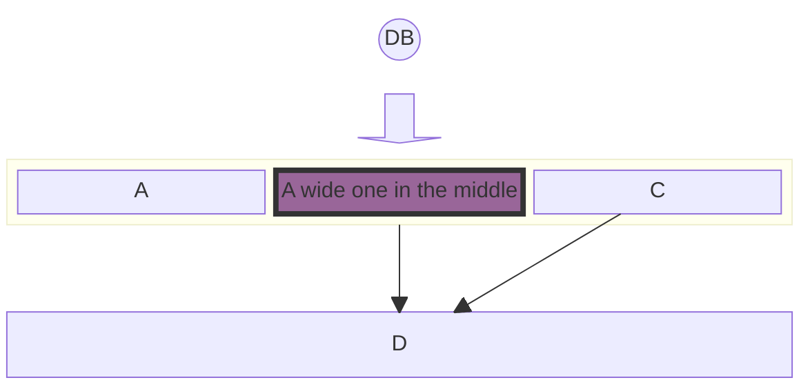
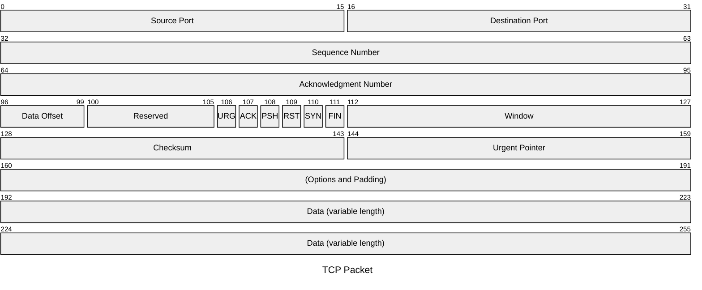
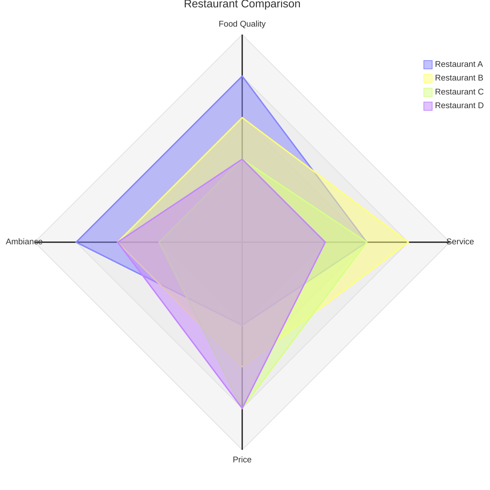
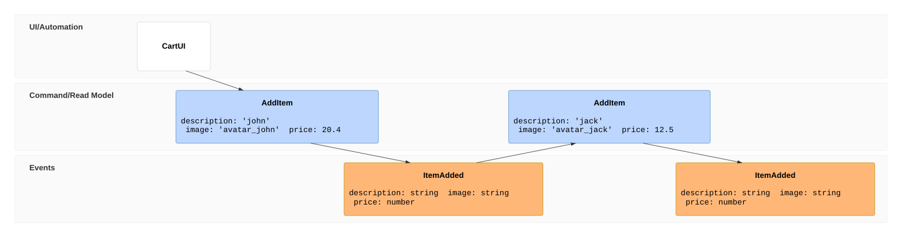
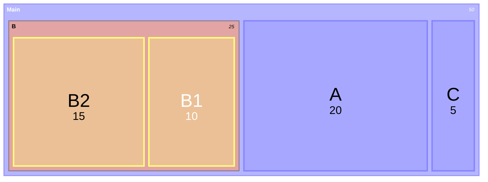
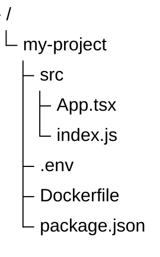

# Mermaid 运行时隔离测试文档

本文档用于在 Tauri 开发环境中逐个测试 Mermaid 图表的渲染情况。

## 测试方法

1. 打开 Tauri 开发服务器：`pnpm tauri dev`
2. 打开开发者工具 (F12) -> Console
3. 筛选 Console 日志：`[Mermaid Debug]`
4. 滚动到对应的图表章节
5. 观察 Console 输出

## 日志格式说明

### 渲染前日志

```
[Mermaid Debug] before render
{
  id: "mermaid-xxx",
  firstLine: "zenuml",
  normalizedType: "zenuml",
  preview: "zenuml\n    try {...",
  mermaidTheme: "base"
}
```

### 渲染成功日志

```
[Mermaid Debug] render success
{
  id: "mermaid-xxx",
  normalizedType: "flowchart",
  svgLength: 12345
}
```

### 渲染失败日志

```
[Mermaid Debug] render failed
{
  id: "mermaid-xxx",
  firstLine: "zenuml",
  normalizedType: "zenuml",
  errorName: "UnknownDiagramError",
  errorMessage: "No diagram type detected matching given configuration for text: zenuml",
  error: Error object
}
```

***

## R1 gitGraph



***

## R2 zenuml

> **暂不支持说明**：ZenUML 不是当前 Mermaid 11.14.0 内置 diagram，需外部插件 `@mermaid-js/mermaid-zenuml` 注册后才可渲染。当前表现：UnknownDiagramError。**不计入 Mermaid 主题系统测试失败**。



***

## R3 block-beta



***

## R4 packet



***

## R5 radar-beta



***

## R6 eventmodeling

> **暂不支持说明**：Event Modeling 不是当前 Mermaid 11.14.0 内置 diagram，当前 `eventmodeling` 关键字会触发 UnknownDiagramError。**不计入 Mermaid 主题系统测试失败**。如未来需要支持，应单独调研外部插件 `@howarddierking/mermaid-event-model` 或正确语法关键字，不在 Phase 15/16A 范围内处理。



***

## R7 treemap-beta



***

## R8 treeview-beta



***

## 测试记录表

| 图表             | firstLine | normalizedType | 渲染结果 | 错误类型 | 错误信息 |
| ---------------- | --------- | -------------- | -------- | -------- | -------- |
| R1 gitGraph      | <br />    | <br />         | <br />   | <br />   | <br />   |
| R2 zenuml        | <br />    | <br />         | <br />   | <br />   | <br />   |
| R3 block-beta    | <br />    | <br />         | <br />   | <br />   | <br />   |
| R4 packet        | <br />    | <br />         | <br />   | <br />   | <br />   |
| R5 radar-beta    | <br />    | <br />         | <br />   | <br />   | <br />   |
| R6 eventmodeling | <br />    | <br />         | <br />   | <br />   | <br />   |
| R7 treemap-beta  | <br />    | <br />         | <br />   | <br />   | <br />   |
| R8 treeview-beta | <br />    | <br />         | <br />   | <br />   | <br />   |


# Phase 17B-R1 强调文字验证

这是普通正文，用来对比强调文字是否过于抢眼。

这是 **粗体文本**，这是 __另一个粗体文本__。

这是 *斜体文本*，这是 _另一个斜体文本_。

这是 ***粗斜体文本***。

这是 **粗体里有 `inline code`​** 的组合。

这是普通链接：[Example](https://example.com)。

这是 **​[粗体链接](https://example.com)​**。

这是 [`链接里的行内代码`](https://example.com)。

这是行内代码：`console.log("Hello")`。

这是 HTML 高亮：<mark>高亮文本</mark>。

请按 <kbd>Ctrl</kbd> + <kbd>S</kbd> 保存。

这是 <samp>sample output</samp>。

这是 ~~删除线文本~~。

这是 <ins>插入文本</ins>。

- 列表正文应该继承正文颜色
- 列表里包含 **粗体文本**
- 列表里包含 `inline code`
- 列表里包含 [链接](https://example.com)
- 列表里包含 <mark>高亮文本</mark>

> 引用块里的 **粗体**、`inline code`、[链接](https://example.com) 也应保持可读。

| 类型 | 示例                        |
| ---- | --------------------------- |
| 粗体 | **bold**                    |
| 代码 | `code`                      |
| 链接 | [link](https://example.com) |
| 高亮 | <mark>mark</mark>           |
| 键盘 | <kbd>Enter</kbd>            |