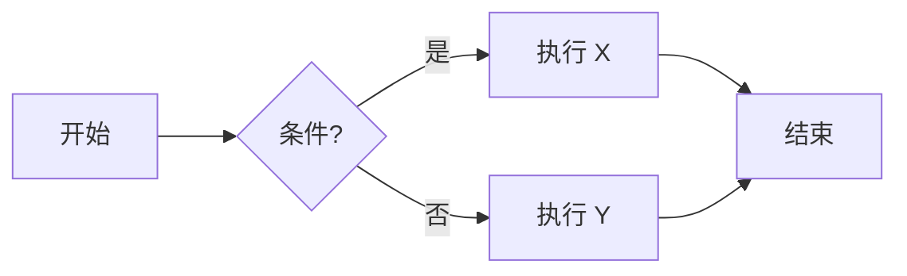
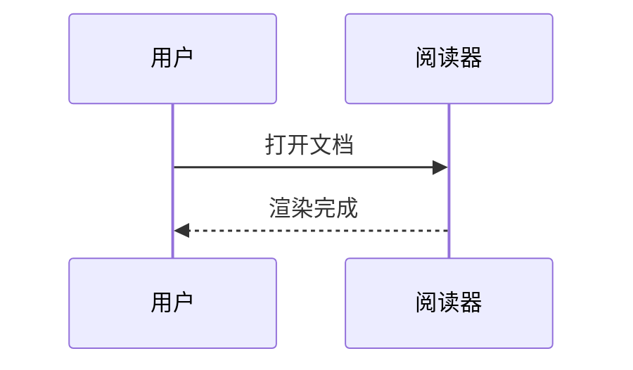
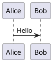

# 一级标题:Obsidian 语法总览

本文件用于测试阅读器对 **Obsidian 风格 Markdown** 的兼容性,涵盖 CommonMark、GFM 扩展以及 Obsidian 独有语法。

## 二级标题:基础格式

### 三级标题

#### 四级标题

##### 五级标题

###### 六级标题

普通段落文本。**加粗**、*斜体*、***加粗斜体***、~~删除线~~、==高亮文本==、`行内代码`。

> 这是一个普通引用。
>
> > 这是嵌套引用。
> > —— 来源信息

---

## 列表

### 无序列表

- 项目 A
  - 子项 A.1
    - 子项 A.1.1
- 项目 B
* 也支持星号
+ 也支持加号

### 有序列表

1. 第一步
2. 第二步
   1. 子步骤
   2. 子步骤
3. 第三步

### 任务列表(GFM + Obsidian 扩展状态)

- [ ] 未完成任务
- [x] 已完成任务
- [/] 进行中(Obsidian 自定义状态)
- [?] 疑问
- [!] 重要
- [-] 已取消

---

## 代码

行内代码:`const x = 42;`

围栏代码块(带语言标识):

```js
function hello(name) {
  return `Hello, ${name}!`;
}
```

```python
def add(a, b):
    return a + b
```

缩进代码块:

    plain text indented code block
    line 2

---

## 表格(GFM)

| 功能     | 是否支持 | 备注          |
| -------- | :------: | ------------- |
| 内部链接 |    ✅     | `[[note]]`    |
| 嵌入     |    ✅     | `![[note]]`   |
| Callout  |    ✅     | `> [!note]`   |
| 数学公式 |    ✅     | MathJax/KaTeX |

---

## 链接

### 外部链接

- 自动链接:<https://obsidian.md>
- Markdown 链接:[Obsidian 官网](https://obsidian.md)
- 带标题:[Obsidian](https://obsidian.md "官方主页")
- 引用式链接:[Obsidian 帮助][help]

[help]: https://help.obsidian.md "Obsidian Help"

### Obsidian 内部链接(Wikilinks)

- 基本内链:[[我的笔记]]
- 带显示文本:[[我的笔记|显示为这个名字]]
- 指向标题:[[我的笔记#某个章节]]
- 指向块:[[我的笔记#^block-id]]
- 带显示文本的标题链接:[[我的笔记#某个章节|查看章节]]
- 同一仓库内不同文件夹:[[文件夹/子文件夹/笔记名]]

### 嵌入(Embed / Transclusion)

- 嵌入整篇笔记:![[我的笔记]]
- 嵌入某个章节:![[我的笔记#某个章节]]
- 嵌入某个块:![[我的笔记#^block-id]]
- 嵌入图片:![[image.png]]
- 嵌入图片并指定宽度:![[image.png|300]]
- 嵌入图片并指定宽高:![[image.png|300x200]]
- 嵌入 PDF 指定页:![[document.pdf#page=3]]
- 嵌入音频:![[audio.mp3]]
- 嵌入视频:![[video.mp4]]
- 标准 Markdown 图片:

### 块引用标识符

这是一个可被引用的段落。 ^block-id-123

下一段可以通过 `[[本文件#^block-id-123]]` 跳转到上面那段。

---

## 标签(Tags)

行内标签示例:#test #markdown/obsidian #阅读器/兼容性 #y2026

嵌套标签:#project/alpha/frontend

合法格式测试:
- #camelCase
- #PascalCase
- #snake_case
- #kebab-case

非法标签(应作为普通文本渲染):#1984 # 空格 #tag!

也可在 frontmatter 的 `tags` 属性中声明(见文件开头)。

---

## 标注 / Callout

> [!note]
> 这是一个 **note** 标注。

> [!info] 自定义标题
> 带自定义标题的 info 标注。

> [!tip]+
> 默认展开的 tip 标注(`+` 表示可折叠且默认展开)。

> [!warning]-
> 默认折叠的 warning 标注(`-` 表示可折叠且默认折叠)。

> [!abstract]
> 摘要类型(别名:summary、tldr)。

> [!todo]
> 待办类型。

> [!success]
> 成功类型(别名:check、done)。

> [!question]
> 问题类型(别名:help、faq)。

> [!failure]
> 失败类型(别名:fail、missing)。

> [!danger]
> 危险类型(别名:error)。

> [!bug]
> Bug 类型。

> [!example]
> 示例类型。

> [!quote]
> 引用类型(别名:cite)。

> [!note] 嵌套 Callout 测试
> 外层内容。
>> [!tip] 内层提示
>> 这是嵌套在 note 里的 tip。

---

## 数学公式

行内公式:质能方程 $E = mc^2$,勾股定理 $a^2 + b^2 = c^2$。

块级公式:

$$
\int_{-\infty}^{+\infty} e^{-x^2}\,dx = \sqrt{\pi}
$$

矩阵:

$$
A = \begin{pmatrix}
1 & 2 & 3 \\
4 & 5 & 6 \\
7 & 8 & 9
\end{pmatrix}
$$

---

## 脚注

这是一句带脚注的话[^1],这是另一句[^long-note]。

[^1]: 这是简单脚注内容。
[^long-note]: 这是一个较长的脚注。

    可以包含多段内容,甚至代码:

    ```bash
    echo "footnote"
    ```

行内脚注(Obsidian 支持):这里有一个内联脚注 ^[这是行内脚注的内容]。

---

## 注释

%% 这是 Obsidian 风格的块级/行内注释,渲染时应被隐藏 %%

%%
多行注释
第二行
%%

<!-- 这是 HTML 注释,同样应被隐藏 -->

---

## HTML 内嵌

<div style="padding:8px;border:1px solid #ccc;">
  这是一段 <b>HTML</b> 内容,用于测试是否允许原生 HTML。
</div>

<details>
<summary>点击展开</summary>

里面是隐藏内容,支持 **Markdown**。

</details>

---

## 图表(Mermaid)





---

## 图表(Obsidian 内嵌支持)

行内 LaTeX 化学式示意:$\ce{H2O}$(若引擎支持 mhchem)。

PlantUML / 其他第三方图表块(若支持):



---

## 转义字符

\*不会变成斜体\*、\`不会变成行内代码\`、$$不会变成链接$$、\#不会变成标题、\$不会进入数学模式。

---

## 分隔线

三种写法都应渲染为水平线:

---

***

___

---

## 结尾

如果以上内容全部正常渲染,说明你的阅读器对 Obsidian 风格 Markdown 的兼容性已基本到位。
