# PlantUML 语法测试文档

> 本文档用于测试 ErgeMD 的 PlantUML 语法兼容功能。
> 支持 ` ```plantuml ` 和 ` ```puml ` 代码块。

## 1. 序列图 (Sequence Diagram)

### 基本序列图

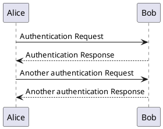

### 带参与者的序列图

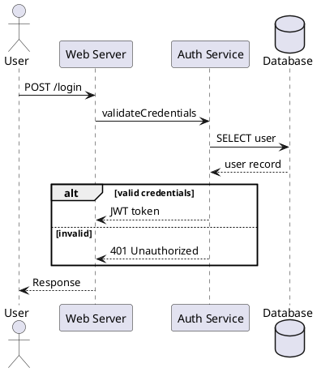

## 2. 类图 (Class Diagram)

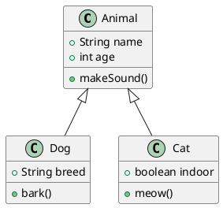

## 3. 活动图 (Activity Diagram)

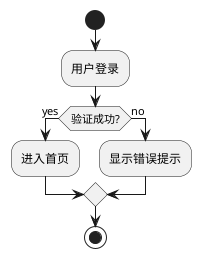

## 4. 组件图 (Component Diagram)

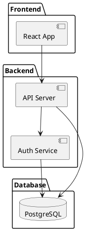

## 5. 状态图 (State Diagram)

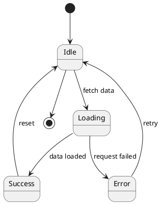

## 6. 对象图 (Object Diagram)

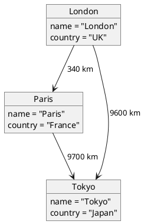

## 7. 用例图 (Use Case Diagram)

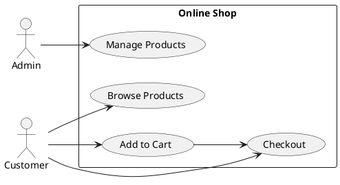

## 8. 部署图 (Deployment Diagram)

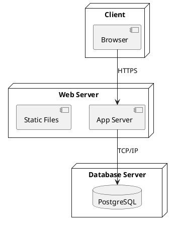

## 9. 时序图/时序图 (Timing Diagram)

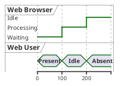

## 10. 网络图 (Network Diagram)

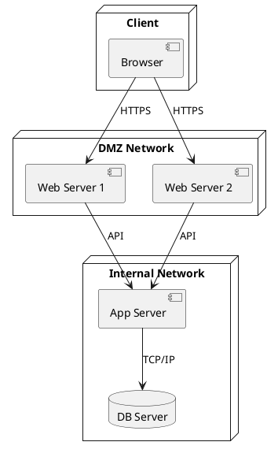

## 11. ER 图 (Entity Relationship Diagram)

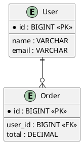

## 12. 思维导图 (Mindmap)

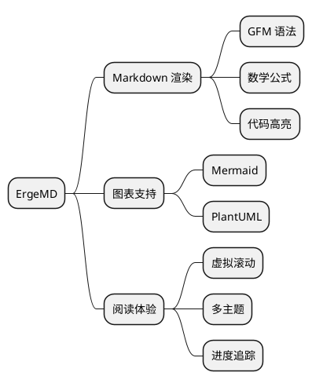

## 13. WBS 工作分解结构 (Work Breakdown Structure)

> 甘特图（`gantt`）和 `@startgantt` 均不被 `@plantuml/core` 支持，此处替换为 WBS 图。

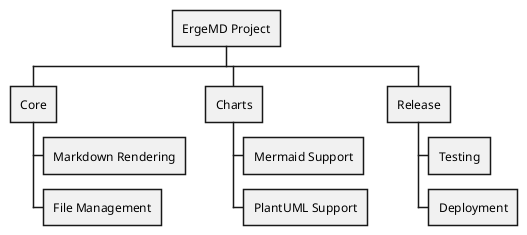

## 14. 反馈图 (Salt/Wireframe 替代)

> Wireframe / Salt 语法（`@startsalt`）和归档图（`archive`）均不被 `@plantuml/core` 支持，此处使用反馈图替代。

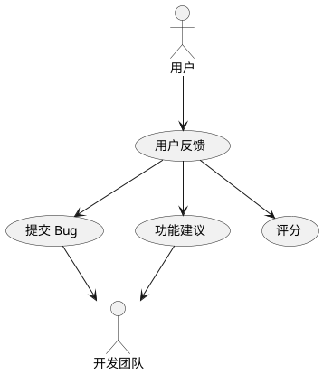

## 15. JSON 数据可视化

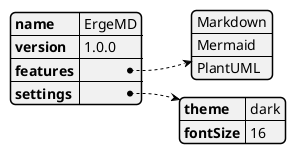

## 16. YAML 数据可视化


## 与 Mermaid 共存测试

下面的 Mermaid 图表应该正常渲染：

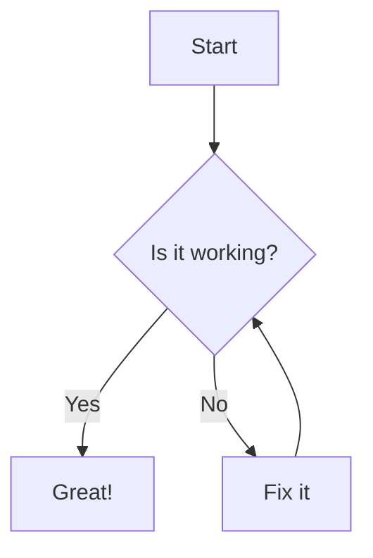

> 如果 Mermaid 图表正常显示，说明两种图表系统共存正常。

## PlantUML 与 Mermaid 语法对比

| 特性 | PlantUML | Mermaid |
|------|----------|---------|
| 代码块标识 | ` ```plantuml ` | ` ```mermaid ` |
| 序列图箭头 | `->`, `-->` | `->>`, `-->>` |
| 参与者声明 | `participant` | 自动推断 |
| 条件分支 | `alt/else/end` | `alt/else` |

## 注意事项

1. PlantUML 代码块必须以 `@startuml` 开头，`@enduml` 结尾
2. 特殊图表类型使用独立标签：`@startmindmap`/`@endmindmap`、`@startjson`/`@endjson`、`@startyaml`/`@endyaml`、`@startwbs`/`@endwbs` 等
3. 渲染采用串行队列，多个图表会依次渲染
4. 以下语法不被 `@plantuml/core` 支持：
   - `nwdiag` 网络图扩展 → 请使用部署图（node）语法替代
   - `gantt` / `@startgantt` 甘特图 → 请使用 WBS 图替代
   - `@startsalt`/`@endsalt`（Wireframe）→ 暂无替代方案
   - `archive` 归档图 → 暂无替代方案
