# 0. 概述

> [!summary] 本文面向读者
> 技术开发者、AI 产品从业者。从 AI 的底层本质出发，梳理从聊天机器人到 AI IDE、OpenClaw 类高级 Agent 系统的完整演进逻辑。
>
> 写作目标：不是泛泛介绍 AI，而是从"AI 的底层本质"讲起，逐步解释为什么 AI 会从语音对话、聊天助手，演化到今天的 AI IDE、Claude Code、OpenClaw 这类高级 Agent 系统。

> [!summary] 相关内容
> [[Model_Context_Protocol_MCP|MCP]]

---

## 1. 引言：AI 从"会聊天"到"能执行任务"

### 1.1 第一代 AI 产品：对话就是全部

> [!note] 概述
> 早期的语音助手（Siri、Google Assistant）和聊天机器人，核心能力是自然语言理解与生成。用户说一句话，AI 返回一句话。它的工作边界非常清晰——**始于对话，止于对话**。
>
> 即使后来出现了基于 GPT-3 的 ChatGPT，本质上仍然停留在"对话窗口"里：用户输入 prompt，模型返回 completion。每次交互是一条独立的信息流，AI 并不对现实世界产生任何实质性改变。

### 1.2 转折点：大模型带来的能力跃迁

> [!note] 三个关键变化
> GPT-3.5 / GPT-4 以及 Claude 3+ 系列模型的出现，带来了三个关键变化：
>
> 1. **理解能力的质变**：不再是关键词匹配，而是上下文语义理解、意图推断、模糊指令消歧。
> 2. **推理能力的涌现**：可以完成多步推理、数学计算、逻辑分析、代码生成等"认知劳动"。
> 3. **工具调用能力的标准化**：模型可以输出结构化指令（function calling / tool use），由外部系统执行。

> [!important] 这三点结合在一起，让 AI 第一次具备了"输出信息以外"的可能性
> 模型不再只是生成文本，而是可以通过工具调用，**直接操作现实世界**。

### 1.3 Agent 的本质变化：从信息生成器到任务执行者

> [!compare] 传统 Chatbot vs Agent 系统

| | 传统 Chatbot | Agent 系统 |
| :--- | :--- | :--- |
| 交互模式 | 输入 → 文本输出 | 输入 → 规划 → 工具调用 → 执行 → 反馈 → 迭代 |
| 状态管理 | 无状态对话 | 有记忆、有上下文管理 |
| 外部操作 | 不操作外部系统 | 操作文件、终端、API、数据库 |
| 任务追踪 | 每次回答独立 | 持续追踪任务状态 |
| 权限控制 | 无权限边界 | 有 Role、Rule、Permission 控制 |

Agent 的核心变化只有一句话：**AI 不再只是"说什么"，而是"做什么"**。

---

## 2. AI 底层的本质：理解大模型的能力边界

> [!question] 为什么必须先理解 AI 底层？
> 只有理解了模型能做什么、不能做什么，才能设计好 Agent 系统。如果连"Transformer 本质是概率预测"都不知道，就无法解释为什么 Agent 需要 Planner、Critic、Feedback Loop 这些附加组件。

### 2.1 AI 不是魔法，是压缩与预测
> [!note] 概述
>大语言模型（LLM）的核心机制可以用一句话概括：**基于海量文本数据训练的参数化概率预测系统**。
>用工程视角理解：
>- **训练阶段**：模型从数万亿 token 的文本中学习模式。所谓"学习"，本质上是把文本中蕴含的知识压缩为模型权重（parameters）。这个过程类似 ZIP 压缩——模型学会用更少的参数"表示"原始数据的统计规律。
>- **推理阶段**：给定上文文本，模型预测下一个最可能的 token。继续预测，就生成了完整的文本。
>
>这就是为什么 AI 看起来"懂"语言——因为它见过足够多的语言模式，能以极高的准确率预测下一个词。

> [!important] 关键认知
> 模型**没有真正的意识或理解**，它是在统计空间中寻找高概率路径。但它表现出来的"理解"，对于工程目的来说已经足够有用。

### 2.2 关键技术的工程意义

| 技术 | 解决的问题 | 工程意义 |
| :--- | :--- | :--- |
| **Token 化** | 将文本映射为数字序列 | 让模型可以处理任意自然语言和代码 |
| **Embedding** | 将语义映射为向量空间 | 实现语义搜索、聚类、相似度计算 |
| **上下文窗口** | 限制模型一次"看到"的信息量 | 决定了 Agent 的短期记忆上限 |
| **注意力机制** | 在长篇文本中聚焦关键信息 | 让模型能处理长距离依赖关系 |
| **推理链（CoT）** | 显式引导模型分步推理 | 显著提升复杂逻辑任务的准确性 |
| **工具调用** | 模型输出结构化工具指令 | 让 Agent 可以操作外部系统 |

### 2.3 为什么单纯的大模型不等于 Agent

> [!warning] 常见误解："模型变强了，Agent 自然就有了"
> 这是当前 AI 行业最常见的认知偏差。事实完全相反。
> - **模型没有持久记忆**：每次对话结束，模型不记得任何事。Agent 的"记忆"需要外部存储。
> - **模型不能主动行动**：模型只有在被调用时才生成文本。Agent 需要 Planner 模块来驱动"下一步做什么"。
> - **模型不可靠**：模型会幻觉、会遗漏、会出错。Agent 需要 Evaluator / Critic 机制来自我纠正。
> - **模型不感知环境**：模型没有眼睛和手。Agent 需要 Tools 层来感知（读取文件、搜索网络）和行动（修改文件、执行命令）。

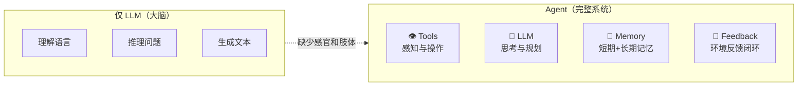

> [!tip] 类比
> 把 LLM 比作大脑，Agent 就是整个身体。大脑负责思考和决策，但需要眼睛看、耳朵听、手操作、脚移动。没有身体的"大脑"只是一个信息生成器。

### 2.4 Agent 的五大基础要素

> [!note] 五大基础要素
> 一个完整的 Agent 系统，需要五大要素协同工作：

| 要素 | 作用 | 类比 |
| :--- | :--- | :--- |
| **模型能力（Model）** | 理解、推理、生成 | Agent 的"大脑" |
| **上下文（Context）** | 当前任务信息、项目状态、历史记录 | Agent 的"短期记忆" |
| **记忆（Memory）** | 持久化知识、用户偏好、项目经验 | Agent 的"长期记忆" |
| **工具（Tools）** | 文件系统、终端、浏览器、API、数据库 | Agent 的"感官和肢体" |
| **环境反馈（Feedback）** | 运行结果、错误信息、用户确认 | Agent 的"感知闭环" |

> [!important] 缺少任何一项，Agent 都会退化成一个单纯的聊天机器人。

---

## 3. Ruler / Rules：规则系统决定 Agent 的行为边界

> [!question] 为什么需要 Rules？
> 模型本身是"通才"——它能写诗、能编程、能翻译、能分析数据。但如果没有规则约束，它就不知道在具体场景中应该扮演什么角色、遵循什么规范、达到什么目标。Rules 将模型的通用能力**定向**到特定的工作场景中。

### 3.1 Rules 是什么
> [!note] 概述
>Rules（规则系统）是 Agent 的行为规范和约束条件。它不是模型能力的一部分，而是通过 system prompt、配置文件、规范文档等形式注入到 Agent 上下文中的**显式指令集**。
>
>常见的 Rules 形式包括：
>- **System Prompt**：开发者预设的全局行为指令
>- **项目规则文件**：如 `.cursor/rules`、`CLAUDE.md`、`AGENTS.md`、`.windsurfrules`
>- **代码规范**：ESLint 配置、Prettier 配置、类型定义
>- **权限边界**：可访问的文件路径、可执行的命令白名单
>- **行为约束**：语言风格、输出格式、禁止操作

### 3.2 Rules 为什么重要

> [!important] 核心原则
> **模型负责智能，规则负责约束和方向。**
>
> 同一个模型，在不同规则下会变成完全不同的"角色"：
>
> - 规则 A：要求"你是一个资深 Java 架构师，只优化性能，不改功能逻辑" → 模型变成性能优化专家
> - 规则 B：要求"你是一个前端新手导师，每次只给最小改动" → 模型变成代码教学助手
> - 规则 C：要求"你必须先写测试，再写实现，最终保证 90% 覆盖率" → 模型变成 TDD 工程师
>
> 没有 Rules 的模型是"通才但不可控"的。Rules 把模型的通用能力**定向**到特定的工作角色和任务目标上。

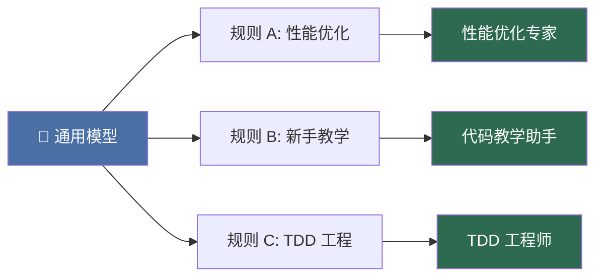

### 3.3 AI IDE 中的 Rules 实践

> [!note] Rules 在 AI IDE 中的典型布局
> 以 Cursor、Claude Code、Windsurf 为代表的 AI IDE 中，Rules 机制已经非常成熟：
>
> ```
> 项目根目录/
> ├── .cursor/rules/          # Cursor 的规则目录
> │   ├── code-style.mdc      # 代码风格规则
> │   └── architecture.mdc    # 架构约束规则
> ├── CLAUDE.md               # Claude Code 项目指令
> ├── AGENTS.md               # Agent 行为说明
> └── .windsurfrules          # Windsurf 规则文件
> ```
>
> 这些文件的作用：
>
> - 告诉 Agent 项目的技术栈和架构（"本项目使用 Vue 3 + TypeScript + Pinia"）
> - 约束 Agent 的代码风格（"使用组合式 API，避免选项式 API"）
> - 定义工作流程（"修改前先写测试，修改后运行测试套件"）
> - 设定安全边界（"不允许修改 `node_modules/` 和 `dist/` 目录"）

### 3.4 Rules 与模型能力的关系

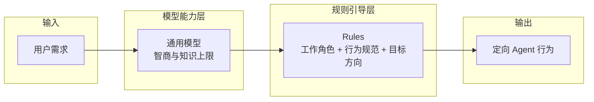

> [!note] 没有 Rules，模型能力再强也无法定向解决具体问题。Rules 太死板，又会限制模型的灵活性和创造力。**好的 Rules 设计是 Agent 产品体验的核心竞争力之一。**

---

## 4. Skill：技能系统增强 Agent 的专业能力

### 4.1 Skill 是什么

> [!note] 概述
> Skill（技能）是可复用、可组合、可沉淀的**能力单元**。它不同于一次性的 prompt——Skill 是一套结构化的指令集和工作流，让 Agent 能稳定、可重复地完成特定类型的任务。
>
> Skill 的表现形式多样：
>
> - 一套 markdown 说明文档（如 `.claude/skills/` 目录下的 SKILL.md）
> - 一个可执行的自动化脚本
> - 一套工具使用的操作规范
> - 一个领域知识的完整描述

### 4.2 Skill 与 Prompt 的区别

> [!compare] Prompt vs Skill

| 维度 | Prompt | Skill |
| :--- | :--- | :--- |
| 用途 | 一次性指令 | 可复用的能力模块 |
| 结构 | 自由文本 | 结构化、带步骤、带约束 |
| 存储 | 用户临时输入 | 文件系统中的标准格式 |
| 可组合性 | 低 | 高（多个 Skill 可组合使用） |
| 版本管理 | 无 | 可纳入 Git 管理 |

> [!tip] 类比
> Prompt 像是口头告诉别人怎么做一件事，Skill 像是一份 SOP（标准作业程序）——它经过了验证、沉淀、优化，任何人都可以拿来使用。

### 4.3 Skill 如何增强 Agent

> [!note] 四大增强能力
> Skill 让 Agent 具有以下能力：
>
> 1. **稳定输出**：遵循固定的工作流，减少随机性
> 2. **领域专业化**：在特定领域（如代码审查、数据分析）表现远超通用 prompt
> 3. **可组合性**：把简单 Skill 组合成复杂工作流
> 4. **持续优化**：Skill 可以被反复打磨，每次使用都在积累经验

### 4.4 Skill 的工程架构

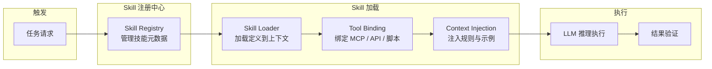

| 组件 | 职责 |
| :--- | :--- |
| **Skill Registry** | 技能注册中心，管理技能元数据和匹配逻辑 |
| **Skill Loader** | 将技能定义加载到 Agent 上下文中 |
| **Tool Binding** | 将技能需要的工具（MCP 服务、API、脚本）绑定到执行环境 |
| **Context Injection** | 将技能相关的规则、示例、约束注入对话上下文 |

### 4.5 Skill 的实际例子

| Skill 名称 | 包含内容 | 效果 |
| :--- | :--- | :--- |
| **代码审查 Skill** | 审查 checklist、安全规则、性能规范、常见模式 | 自动审查 PR，标注问题严重级别 |
| **数据分析 Skill** | SQL 模板、可视化工具配置、统计分析流程 | 用户说"分析上月用户留存"，Agent 自动完成全流程 |
| **自动化运维 Skill** | Docker 命令集、部署脚本、监控 API、回滚流程 | 故障时自动排查、修复、通知 |
| **报告生成 Skill** | 模板结构、数据源配置、图表工具、导出流程 | 从数据收集到最终文档全自动 |
| **PPT 生成 Skill** | MCP + API 调用演示文稿服务、模板管理 | 从大纲到完整演示文稿 |

---

## 5. Agent 的核心架构：系统级拆解

### 5.1 Agent 的八大组件

> [!note] 一个通用 Agent 系统，由以下核心组件构成

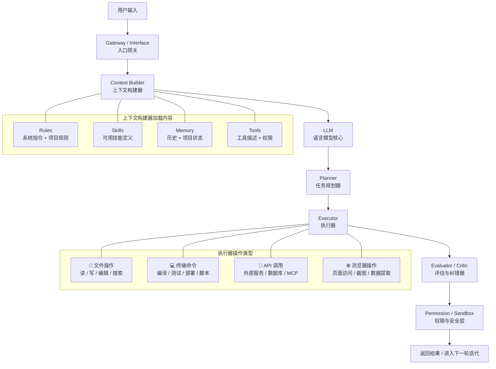

| 组件 | 职责 |
| :--- | :--- |
| **Gateway / Interface** | 接收输入、会话管理、身份识别、请求路由 |
| **Context Builder** | 组装 Rules、Skills、Memory、Tools 为完整上下文 |
| **LLM** | 理解意图、推理链、生成行动指令 |
| **Planner** | 复杂任务拆解、执行顺序编排、动态调整 |
| **Executor** | 文件操作、终端命令、API 调用、浏览器操作 |
| **Evaluator / Critic** | 验证结果、检测错误、触发修复流程 |
| **Permission / Sandbox** | 操作权限校验、文件边界控制、命令白名单 |
| **Feedback Loop** | 观察结果 → 评估 → 再决策的闭环 |

### 5.2 完整流程实例：用户让 Agent 修改项目代码

> [!example] 场景：用户说 **"帮我修一下登录页面的样式，按钮在手机上显示不全"**

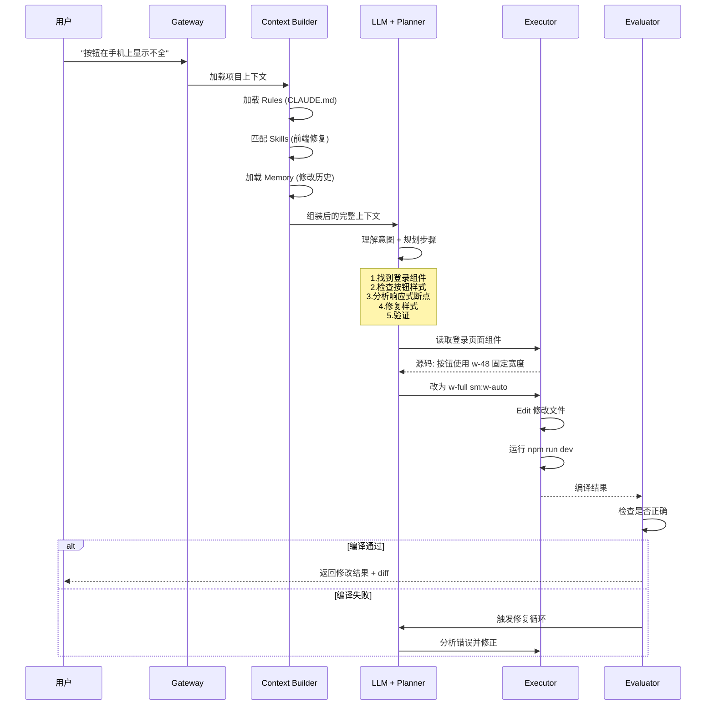

**Step 1 - 入口网关**

> [!note] Gateway 层
> Agent 确认用户身份、加载项目上下文、识别这是一个"前端样式修复"任务。

**Step 2 - 上下文构建**

> [!note] Context Builder 层
> - 加载 Rules：项目的 CLAUDE.md 中说明"使用 Tailwind CSS，移动端优先"
> - 加载 Skills：匹配"前端修复"Skill，包含 Vue 组件规范和 Tailwind 类名参考
> - 加载 Memory：用户之前的修改记录、当前分支状态
> - 注入 Tools：文件读/写、终端命令的权限

**Step 3 - LLM 规划**

> [!note] Planner 层
> 模型理解任务后，Planner 模块生成步骤：
> 1. 找到登录页面的 Vue 组件文件
> 2. 检查按钮的样式定义
> 3. 分析移动端断点的响应式处理
> 4. 修复样式
> 5. 验证修复效果

**Step 4 - 执行**

> [!note] Executor 层
> - `Read` 登录页面组件源码 → 发现按钮用了固定宽度 `w-48`，在手机上溢出
> - 判断修复方案：改为 `w-full sm:w-auto`（移动端全宽，桌面端自适应）
> - `Edit` 修改文件
> - `Terminal` 运行 `npm run dev` 验证编译通过

**Step 5 - 评估与迭代**

> [!note] Evaluator / Critic 层
> - Critic 检查修改是否正确，是否引入新的问题
> - 验证通过后，返回修改结果给用户
> - 如果编译错误，进入修复循环：分析错误 → 修正 → 重新编译

**Step 6 - 反馈闭环**

> [!tip] Memory 持久化
> 完成后，Agent 把这次修改记录到 Memory 中，下次遇到类似问题可以更快处理。

### 5.3 Feedback Loop 的重要性

> [!tip] 核心观点
> 单次模型调用是"猜"，多次迭代是"做"。Feedback Loop 是 Agent 从"生成式"走向"工程式"的关键。
>
> 没有反馈循环的 Agent，本质上仍然是一个一次性的文本生成器。有了反馈循环：
>
> - Agent 可以自我纠错
> - Agent 可以从环境反馈中调整行为
> - Agent 可以长时间运行、多步协作、最终交付完整结果

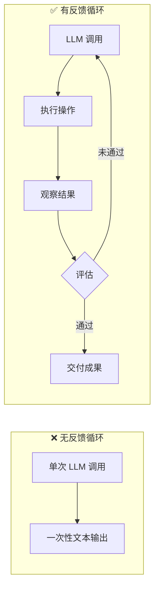

---

## 6. AI IDE 的实现原理

### 6.1 AI IDE 的本质

> [!note] 核心洞见
> Cursor、Claude Code、Windsurf、GitHub Copilot Workspace 等 AI IDE / Coding Agent 的核心洞见是：

> [!important] 核心论断
> **AI IDE 不是"更聪明的代码补全"，而是"带工具、上下文和反馈循环的软件工程 Agent"。**

> [!note] AI IDE 与传统代码补全的本质区别
> 传统代码补全（TabNine、GitHub Copilot 补全模式）只在光标位置预测下一段代码。AI IDE 要做的是：
>
> - 理解整个项目的架构和上下文
> - 与开发者协作完成功能开发、Bug 修复、重构等工程任务
> - 主动操作文件、运行命令、查看结果、迭代修复

### 6.2 AI IDE 的底层工作流

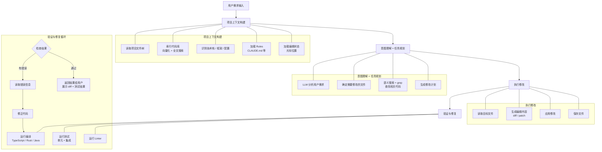

### 6.3 关键技术点

**1. 代码库索引**

> [!note] 索引内容
> AI IDE 本地会对代码库建立索引，包括：
> - 文件路径和目录结构
> - 代码语义向量（用于相似度搜索）
> - 符号表和引用关系（类、函数、变量的定义和引用）
> - Git 历史（理解代码变更上下文）

**2. 上下文窗口管理**

> [!note] 上下文窗口管理策略
> LLM 的上下文窗口有限（Claude 3.5 为 200K tokens，GPT-4 为 128K tokens），而大型代码库远超此限制。AI IDE 需要：
> - **选择性加载**：只加载相关文件的内容
> - **分层摘要**：对不相关但需要的文件生成摘要
> - **动态替换**：在迭代过程中替换不再需要的上下文

**3. 编辑策略**

> [!compare] 四种编辑策略对比

| 策略 | 方式 | 适用场景 |
| :--- | :--- | :--- |
| 全文件替换 | 直接重写整个文件 | 小文件、新文件创建 |
| 精确编辑 | 定位到具体行/区块修改 | 大型文件的局部修改 |
| diff/patch | 生成结构化 diff | 需要应用/回滚的场景 |
| Search & Replace | 搜索+替换特定代码模式 | 批量重构 |

**4. 终端集成**

> [!note] 终端操作能力
> AI IDE 与终端深度集成，Agent 可以：
> - 运行构建命令（`npm run build`、`cargo build`）
> - 运行测试（`pytest`、`jest`、`go test`）
> - 执行 Lint 和格式化
> - 启动开发服务器
> - 读取命令行输出并理解错误

### 6.4 AI IDE 的分层能力模型

> [!note] AI IDE 的五级能力演进
>
> ```mermaid
> flowchart TB
>     subgraph L1["Level 1"]
>         A[代码补全<br/>GitHub Copilot 补全模式]
>     end
>
>     subgraph L2["Level 2"]
>         B[内联编辑<br/>Cursor Tab / Copilot 内联建议]
>     end
>
>     subgraph L3["Level 3"]
>         C[对话式编码<br/>ChatGPT + 手动复制粘贴]
>     end
>
>     subgraph L4["Level 4"]
>         D[半自主 Agent<br/>Cursor Agent / Windsurf Cascade]
>     end
>
> >     subgraph L5["Level 5"]
>         E[自主工程 Agent<br/>Claude Code / OpenClaw Code Agent<br/>理解→规划→修改→测试→迭代→交付]
>     end
>
>     A --> B --> C --> D --> E
> ```
>
> 最顶层的 AI IDE，本质上是一个**以软件开发为目标的高度特化 Agent 系统**。

---

## 7. OpenClaw 类高级 Agent 的实现原理

### 7.1 定位：从 IDE 到跨渠道 Agent Gateway

> [!note] 架构进化
> OpenClaw 和类似的系统（如 Claude Code Server、自托管 Agent 平台）代表了 Agent 架构的下一次进化——**从"开发环境内的工具"到"无处不在的 Agent 入口"**。

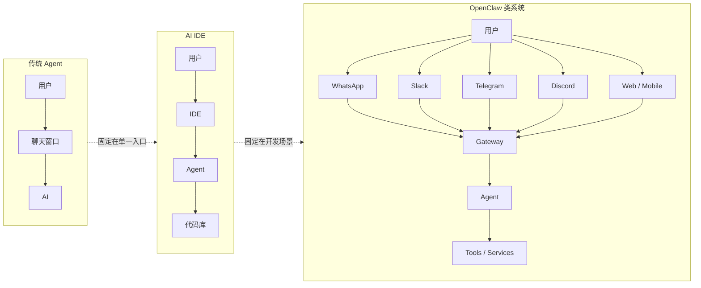

### 7.2 OpenClaw 的核心架构

> [!note] 以下基于公开资料和合理工程推断。
>
> ```mermaid
> flowchart TB
>     subgraph Entry["多渠道入口层"]
>         WA[WhatsApp]
>         SL[Slack]
>         TG[Telegram]
>         DC[Discord]
>         WC[WebChat]
>         MO[Mobile App]
>     end
>
>     subgraph Gateway["Gateway 网关层"]
>         GW1[消息适配器<br/>每个渠道一个 Adapter]
>         GW2[会话管理<br/>Session 路由 + 状态保持]
>         GW3[身份认证<br/>用户映射 + 权限校验]
>         GW4[消息队列<br/>异步处理 + 限流 + 重试]
>         GW5[多 Agent 路由<br/>不同任务 → 不同 Agent]
>     end
>
>     subgraph AgentMgr["Agent 管理层"]
>         AM1[Agent 实例池<br/>每个会话独立实例]
>         AM2[Rules 加载器<br/>全局规则 + 用户规则]
>         AM3[Skills 注册中心<br/>技能列表 + 匹配引擎]
>         AM4[Memory 存储<br/>对话历史 + 偏好 + 状态]
>         AM5[Context 组装<br/>拼装完整 Agent 上下文]
>     end
>
>     subgraph LLMLayer["LLM 推理层"]
>         LM1[多模型支持<br/>Claude / GPT / 本地模型]
>         LM2[模型路由<br/>简单→小模型 复杂→大模型]
>         LM3[推理缓存<br/>减少重复调用]
>     end
>
>     subgraph ToolLayer["Tool 执行层"]
>         TL1[文件系统<br/>本地 + 云存储 + 仓库]
>         TL2[终端 / Shell<br/>命令执行 + 脚本]
>         TL3[MCP 服务<br/>数据库 / 浏览器 / API]
>         TL4[代码仓库操作<br/>Git clone / commit / PR]
>         TL5[外部 API<br/>第三方服务集成]
>     end
>
>     WA --> Gateway
>     SL --> Gateway
>     TG --> Gateway
>     DC --> Gateway
>     WC --> Gateway
>     MO --> Gateway
>
>     Gateway --> AgentMgr
>     AgentMgr --> LLMLayer
>     LLMLayer --> ToolLayer
> ```

### 7.3 关键设计决策

**1. 消息适配器模式**

> [!note] 渠道适配
> 每个渠道（WhatsApp、Slack、Telegram、Discord）实现一个 Adapter，负责：
> - **协议转换**：HTTP Polling / WebSocket / Webhook → 统一消息格式
> - **媒体处理**：图片、文件、语音消息的下载和预处理
> - **频道特性适配**：Slack 的 Block Kit、Telegram 的 Inline Button 等

**2. 多 Agent 隔离**

> [!important] 隔离策略
> 不同用户、不同项目使用独立的 Agent 实例，保障：

| 隔离维度 | 说明 |
| :--- | :--- |
| **上下文隔离** | A 项目的文件不会泄漏到 B 项目 |
| **权限隔离** | 每个 Agent 实例有独立的权限配置 |
| **资源隔离** | 一个 Agent 的崩溃不影响其他 Agent |

**3. 异步消息处理**

> [!note] 异步处理策略
> 由于 LLM 推理时间较长（数秒到数十秒），Gateway 使用消息队列实现：

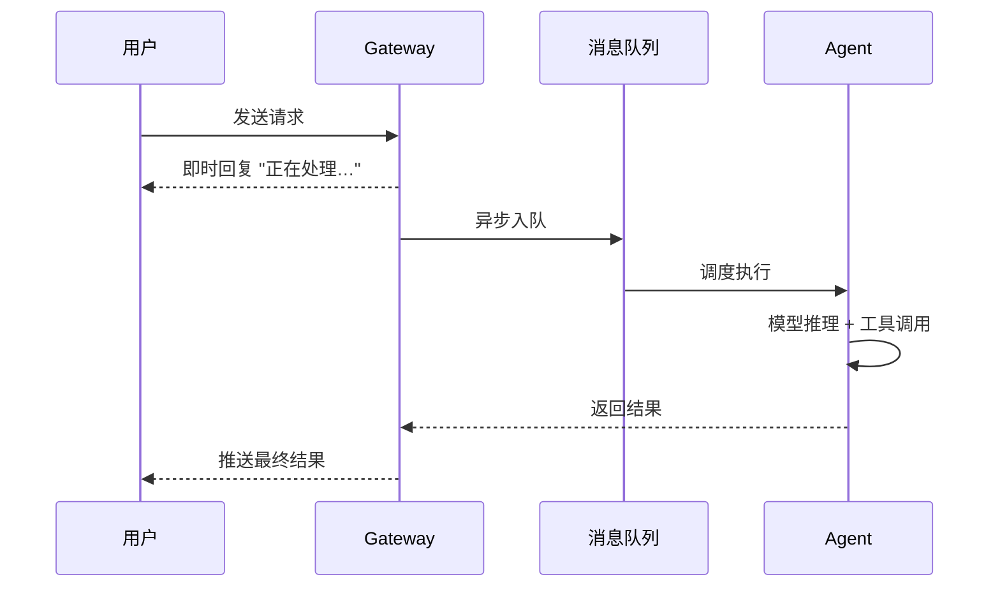

**4. 模型路由**

> [!note] 路由策略
> 不同类型的请求路由到不同模型：

| 请求类型 | 路由目标 | 考量 |
| :--- | :--- | :--- |
| 简单对话 | 低成本小模型 | 速度快、成本低 |
| 代码生成 | 代码专用模型 | 代码质量更高 |
| 复杂推理 | 最强模型（Claude Opus / GPT-4） | 推理能力最强 |

### 7.4 OpenClaw 与 AI IDE 的关系

> [!compare] 维度对比

| 维度 | AI IDE | OpenClaw 类系统 |
| :--- | :--- | :--- |
| **入口** | IDE 编辑器 | 消息应用 + Web + 移动端 |
| **场景** | 软件工程 | 通用任务 + 开发 + 运维 + 管理 |
| **上下文** | 项目代码 | 项目代码 + 对话历史 + 多源数据 |
| **操作** | 文件 + 终端 | 文件 + 终端 + API + 渠道特有操作 |
| **状态** | 当前编辑会话 | 长期在线、随时可唤醒 |
| **治理** | 个人使用 | 支持团队协作、权限管理 |

> [!tip] 一句话区分
> AI IDE 是**以代码为中心**的 Agent 入口，OpenClaw 类系统是**以消息为中心**的 Agent 操作系统入口。

---

## 8. 从 Ruler + Skill + Agent 到高级智能体系统

### 8.1 拼齐所有拼图

> [!compare] 高级 Agent 系统 vs 组织架构

| 组件 | 类比 | 作用 |
| :--- | :--- | :--- |
| **Rules** | 公司章程 + 员工手册 | 定义行为边界、文化规范、做事原则 |
| **Skills** | 部门 SOP + 专业技能 | 定义能做什么、怎么做、做到什么标准 |
| **Tools** | 办公设备 + 软件系统 | 实际操作世界的工具 |
| **Memory** | 公司档案 + 个人笔记 | 记住历史、经验和上下文 |
| **Planner** | 项目经理 | 拆解任务、分配资源、规划路径 |
| **Executor** | 执行工程师 | 动手做具体工作 |
| **Evaluator** | QA + 技术评审 | 检查质量、发现问题、推动修复 |
| **Gateway** | 前台 + 接线员 | 接入外部请求、路由到正确的人 |

### 8.2 系统的整体工作流

> [!note] 端到端 Agent 工作流
>
> ```mermaid
> flowchart TB
>     U[用户通过任意渠道发出请求] --> GW[Gateway / Interface<br/>认证 → 路由 → 会话恢复]
>
>     GW --> CA[Context Assembly<br/>上下文组装]
>
>     CA --> R[Rules<br/>行为边界 + 目标方向]
>     CA --> S[Skills<br/>能力模板 + 工作流]
>     CA --> M[Memory<br/>历史 + 状态 + 偏好]
>     CA --> T[Tools<br/>可用操作 + 权限]
>
>     R --> LOOP
>     S --> LOOP
>     M --> LOOP
>     T --> LOOP
>
>     subgraph LOOP["Agent 循环"]
>         L1[理解意图]
>         L2[规划步骤<br/>Planner]
>         L3[执行动作<br/>Executor]
>         L4[观察结果<br/>Feedback]
>         L5[评估与纠错<br/>Critic]
>
>         L1 --> L2 --> L3 --> L4 --> L5
>         L5 -->|未完成| L2
>     end
>
>     LOOP --> RES[返回结果给用户<br/>文本 / 代码 / 文件 / 截图 / 链接]
> ```

### 8.3 这个架构为什么是"高级"的

> [!compare] 简单 Agent vs 高级 Agent 系统
>
> ```mermaid
> flowchart LR
>     subgraph Simple["简单 Agent"]
>         SG1[一套 Prompt] --> SG2[一次 LLM 调用] --> SG3[文本输出]
>     end
>
>     subgraph Advanced["高级 Agent 系统"]
>         AD1[Rules 约束方向]
>         AD2[Skills 提供能力]
>         AD3[Tools 连接世界]
>         AD4[Memory 保持状态]
>         AD5[Planner 分解任务]
>         AD6[Executor 执行操作]
>         AD7[Critic 确保质量]
>         AD8[Gateway 无处不在]
>     end
>
>     Simple -.->|退化为聊天机器人| Advanced
> ```

> [!important] 每一层都是正交叠加的
> 你可以单独升级模型而不改其他层，也可以丰富 Skill 库而不影响 Rules。这种正交性让高级 Agent 系统具备了传统单体 AI 应用无法比拟的可演进性。

---

## 9. 未来趋势

### 9.1 Agent 从单点工具到工作流中枢

> [!note] 从点状工具到统一中枢
> 今天的 Agent 还是"点状"存在的——打开 IDE 是 Cursor，打开浏览器是 ChatGPT，打开 Slack 是某个 Bot。未来的 Agent 会成为一个**统一的工作流中枢**：
>
> - 你通过消息应用告诉 Agent 一个需求
> - Agent 自动在代码仓库创建分支、编写代码、运行测试、提交 PR
> - PR 通过后，Agent 自动部署到测试环境
> - 测试环境验证通过后，Agent 通知团队进行 Code Review
> - Review 通过后，Agent 完成合并和上线
>
> ```mermaid
> flowchart LR
>     U[你] -->|"在 Slack 说：<br/>加一个登录页"| AG[Agent 工作流中枢]
>     AG --> BR[创建 Git 分支]
>     BR --> CD[编写代码]
>     CD --> TS[运行测试]
>     TS --> PR[提交 PR]
>     PR --> DEP[自动部署测试环境]
>     DEP --> CR[通知 Team Review]
>     CR --> MR[合并 + 上线]
> ```
>
> 这就是 Agent as an Operating System 的愿景——Agent 不再是某个应用里的功能，而是**编排所有数字工具的中枢**。

### 9.2 AI IDE 成为软件工程的新入口

> [!compare] 传统 vs AI IDE 开发流程
>
> 传统的软件开发流程：
>
> ```mermaid
> flowchart LR
>     A1[需求文档] --> A2[设计] --> A3[编码] --> A4[Review] --> A5[测试] --> A6[部署]
> ```

> AI IDE 时代：
>
> ```mermaid
> flowchart LR
>     B1[自然语言需求] --> B2[AI IDE<br/>Agent 完成编码+测试+文档+部署] --> B3[人类审查修改] --> B4[上线]
> ```

> [!tip] 角色升级
> 开发者的角色从"写代码的人"变成"审查 AI 产出、做架构决策、处理复杂问题的人"。这并不意味着开发者失业，而是**开发者被提升到了更高层次的抽象**。

### 9.3 OpenClaw 类系统让 Agent 无处不在

> [!note] 多入口趋势
> 多入口 Agent 系统的趋势：
>
> ```mermaid
> flowchart TB
>     subgraph Today["现状：分散"]
>         T1[IDE → Cursor]
>         T2[浏览器 → ChatGPT]
>         T3[Slack → 独立 Bot]
>     end
>
>     subgraph Future["未来：统一"]
>         F1[消息应用<br/>Slack / Teams / Discord]
>         F2[移动端<br/>iOS / Android]
>         F3[企业系统<br/>Jira / Confluence / CRM]
>         F1 --> H[统一 Agent 网关]
>         F2 --> H
>         F3 --> H
>     end
> ```

> [!note] 演进方向
>
> - 从 IDE 到消息应用（Slack、Teams、Discord、Telegram）
> - 从桌面到移动端
> - 从个人使用到企业团队协作
> - 从单 Agent 到多 Agent 协作
> - 从被动响应到主动监控和预警

### 9.4 未来的竞争维度

> [!question] 当模型本身趋于同质化，真正的竞争在哪儿？
>
> 模型能力当然是基础，但当各家模型差距逐渐缩小，真正的差异化在于围绕 Agent 的基础设施和生态体系。

| 竞争维度 | 意义 |
| :--- | :--- |
| **上下文工程** | 如何在有限的上下文窗口内装入最关键的信息 |
| **工具生态** | 连接多少外部系统，提供多少可用工具 |
| **权限治理** | 精细的权限控制、审计日志、合规性 |
| **技能市场** | 可共享、可交易、可组合的 Skill 生态 |
| **工作流闭环** | 从需求到交付的全流程自动化能力 |
| **可靠性** | 可预测、可调试、可回滚的 Agent 行为 |
| **成本优化** | 模型路由、缓存复用、Token 压缩 |

### 9.5 关键挑战

> [!danger] 高级 Agent 系统要走向大规模落地，仍需解决以下问题
>
> - **可靠性**：Agent 在复杂任务中的失败率仍偏高，如何保证关键任务的可靠性？
> - **安全性**：Agent 操作文件系统、执行命令、访问网络——权限泄露的风险有多大？
> - **可解释性**：Agent 为什么做了某个操作？能否审计和追踪？
> - **成本**：长时间运行的 Agent 调用量巨大，如何控制 Token 消耗？
> - **隐私**：用户代码和数据经过第三方 API，数据隔离如何保障？
> - **组织治理**：企业中谁为 Agent 的行为负责？如何设定 Agent 的操作边界？

---

## 结语：从语言生成到任务执行

> [!quote] 核心观点
> AI 的进化，不是从"不会思考"到"会思考"——大模型本质上仍然是基于统计的预测系统，它没有意识、没有欲望、没有自我。
>
> AI 真正的进化是：**从"只能生成语言"到"能在规则、技能、工具和反馈的闭环中完成真实任务"**。

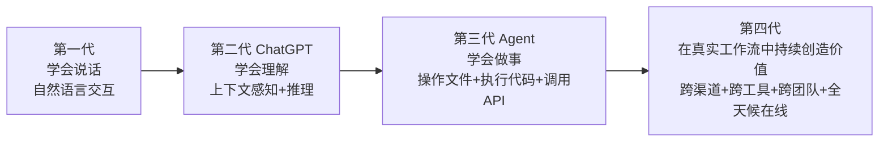

> [!quote] 未来的 AI，不是更聪明的对话者，而是更可靠的执行者。

---

> [!summary] 本文要点回顾
>
> - AI 底层的本质是概率预测，不是魔法——理解边界才能用好它
> - Rules 决定 Agent 的行为方向，Skills 决定 Agent 的专业能力
> - Agent = LLM + Memory + Tools + Planner + Executor + Critic + Feedback Loop
> - AI IDE 是特化于软件开发的 Agent 系统，OpenClaw 类是跨渠道的 Agent Gateway
> - 未来竞争在于上下文工程、工具生态、权限治理和工作流闭环
> - AI 的进化是从"语言生成"到"任务执行"的跃迁
